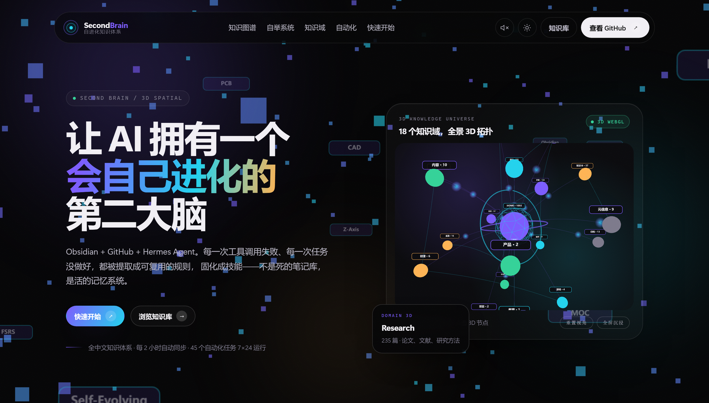
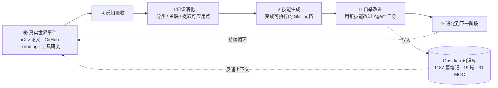

# 🧠 Second Brain — AI Agent 第二大脑

<div align="center">

  **让 AI 拥有一个会自己进化的第二大脑**
  <br>
  **Obsidian + GitHub + Hermes Agent · 1094 篇知识体系 · 18 域全景拓扑 · 7 大自举系统**

  <p>
    <a href="https://mo9652962-ai.github.io/second-brain/">✨ 3D 全景沉浸式官网</a>
    ·
    <a href="https://mo9652962-ai.github.io/second-brain/kb/">📚 在线知识库 (MkDocs)</a>
    ·
    <a href="llms.txt">🤖 llms.txt (AI 直读)</a>
    ·
    <a href="knowledge/METABOLISM.md">🌿 知识新陈代谢 (OKM)</a>
    ·
    <a href="HOME.md">知识中枢 (HOME)</a>
    ·
    <a href="skills/hermes/">🔄 七大自举系统</a>
    ·
    <a href="https://github.com/mo9652962-ai/second-brain/actions/workflows/deploy-docs.yml">GitHub Pages 部署</a>
  </p>

  <p>
    
    
    
    
    
    
    
  </p>

  <p>
    <b>🎯 适合谁？</b> 想用 AI 构建第二大脑的个人开发者 · 研究生/科研人员 · AI Agent 爱好者 · 闲鱼接单自由职业者
  </p>

</div>

> 🌟 **全新 3D WebGL 宇宙与全景星空官网已上线**：👉 [在线体验 3D 知识图谱宇宙与自举演化剖析](https://mo9652962-ai.github.io/second-brain/)  
> **核心交互体验**：3D 全景知识拓扑宇宙 · 7 大自举系统演化剖析器 · 18 域 677 篇知识实时检索 · 24H 自动化流水线雷达 · Web Audio 空间合成音效

<div align="center">
  <a href="https://mo9652962-ai.github.io/second-brain/">
    
  </a>
</div>

---

## 🚀 30 秒快速上手

### 方式 1：用 Obsidian 打开（推荐）

```bash
# 1. 克隆仓库
git clone https://github.com/mo9652962-ai/second-brain.git

# 2. 用 Obsidian 打开
#   → 设置 → 金库 → 打开文件夹作为金库
#   → 选择 second-brain 文件夹 → 开始探索！

# 3. 推荐起点
#   HOME.md → 知识中枢，了解全景
#   skills/  → 直接可用的技能文档
#   INDEX.md → 全库索引
```

### 方式 2：直接在 GitHub 上看

浏览 `knowledge/`（知识笔记）或 `skills/`（可执行技能），全部用 Markdown 编写，GitHub 直接渲染。

---

## 🤔 这是什么？

<div align="center">
  
</div>

这是一个基于 **Obsidian + Hermes Agent** 的自进化知识库系统。它不是一个死的笔记集合，而是一个会自己学习、自己进步、自己进化的「第二大脑」。

每一次工具调用失败、每一次用户反馈、每一次任务没做好，都会被自动提取为可复用的规则，固化成 Skill，让下次做得更好。



---

## 🧠 核心卖点：七大自举进化系统

点击直达对应技能 ↓

| 自举模块 | 解决的核心痛点 | 成熟度 |
|---------|-------------|-------|
| 🤝 [交互自举](skills/hermes/hermes-workflow-preferences.md) | 凌晨 1 小时投入用户醒来全删了 | ⭐⭐⭐⭐⭐ 5/5 |
| ⚙️ [可靠性自举](skills/hermes/hermes-automation-patterns.md) | Cron 任务集中雪崩，批量失败 | ⭐⭐⭐⭐⭐ 5/5 |
| 📚 [知识自举](skills/hermes/daily-knowledge-absorption-gate.md) | 全天被动响应，零主动知识输入 | ⭐⭐⭐⭐⭐ 5/5 |
| 🔧 [工具调用自举](skills/hermes/tool-call-bootstrapping.md) | 同样的工具错误，反复踩坑 | ⭐⭐⭐⭐ 4/5 |
| 💻 [代码质量自举](skills/hermes/code-quality-bootstrapping.md) | 同样的代码问题，用户反复纠正 | ⭐⭐⭐⭐ 4/5 |
| 🎨 [输出风格自举](skills/hermes/output-style-bootstrapping.md) | 对话越长，输出风格越跑偏 | ⭐⭐⭐⭐⭐ 5/5 |
| 🧭 [上下文管理自举](skills/hermes/context-management-bootstrapping.md) | 重要信息上下文被稀释，自动遗忘 | ⭐⭐⭐⭐ 4/5 |

**系统整体成熟度：32 / 35 = 91%，持续进化中**

---

## 🌿 知识新陈代谢 (OKM — Open Knowledge Metabolism)

借鉴 Karpathy 的 **LLM Wiki** 范式与 GitHub 高星第二大脑架构，知识库不是只增不减（Append-only）的死仓库，而是一套具有自我生长、演进与淘汰能力的活体知识系统：

- **🌲 常青笔记 (Evergreen, 332 篇 / 47.2%)**：结构完备、双向链接闭环、实战沉淀的高信号资产。
- **🌿 成长笔记 (Budding, 365 篇 / 51.8%)**：包含基本推演与领域上下文，处于持续求证与拓展中的进阶笔记。
- **🌱 萌芽速记 (Seed)**：捕获的原始事实、想法或灵感种子，定期被消化蒸馏。
- **📦 降级标记 (Superseded)**：支持 `superseded_by: [[新笔记]]` 标记过时结论，抗击认知熵增。
- 👉 查看完整治理看板：[knowledge/METABOLISM.md](knowledge/METABOLISM.md)

---

## 🤖 AI-First 架构支持 (`/llms.txt` 标准)

本仓库遵循 [llmstxt.org](https://llmstxt.org/) 协议，为各类外部 AI 编码助手（Claude Code、Cursor、OpenCode、Hermes 等）提供机器直接可读的轻量化上下文包：

- **纲要索引**：[`/llms.txt`](llms.txt) — 18 域全景结构与高频核心 MOC 节点汇总
- **平铺知识上下文**：[`/llms-full.txt`](llms-full.txt) — 200KB+ 高密度精选纯净知识平铺包，无需克隆即可整库灌入 LLM Prompt

---

## 🗺️ 知识全景树

点击直达对应领域目录 ↓

| 图标 | 知识域 | 核心内容 | 代表技能 |
|:----:|:-------|:---------|:---------|
| 🤖 | **[Hermes 自举系统](skills/hermes/)** | Agent 七大自举、Cron 自动化、工作流优化 | 自举模式 7 个、GitHub 仓库优化、同步脚本 |
| 🧠 | **[AI / MLOps](skills/ai/)** | LLM 微调、训练流水线、部署优化 | LlamaFactory 指南、QLoRA 参数调优 |
| 🔧 | **[硬件工程](skills/hardware/)** | PCB 设计、嵌入式、3D 建模、开源硬件创业 | PCB 设计自动化、CAD 全流程、单片机边缘 AI |
| 💻 | **[Web 开发](skills/web/)** | 现代 Web 全栈、TypeScript、Next.js | 现代 Web 开发 2026（10 轮研究整合） |
| 🏗️ | **[平台开发](skills/platform/)** | SaaS 架构、多租户、API 设计、计费系统 | 平台开发 2026 完整指南 |
| 📱 | **[移动端开发](skills/dev/)** | Flutter、React Native、跨平台选型 | 跨平台移动端开发 2026 对比指南 |
| 🔐 | **[网络安全 / CTF](skills/dev/)** | Web 安全、密码学、逆向工程、入门路线 | CTF 从零开始学习路径 |
| 📚 | **学术科研** | 论文写作、去 AI 化、知网检索、学术变现 | 知网高级检索、论文写作工作流 |
| 🎨 | **设计/多媒体** | PPT 设计、AI 美学、图像生成工具 | PPT 优化、AI 图像生成 |
| 📊 | **效率方法论** | Obsidian 技巧、自动化工作流 | Obsidian 知识图谱、自动化工作流 |

**📈 总计：25 个自建技能文档（11 大知识域）· 26 个外部技能集参考**（2026-09-19 核验）

---

## ✨ 五大独特之处

1. **🚀 国内唯一公开的 Agent 自举系统**
   - 从真实错误中学习，固化为规则，永远不再踩第二次坑
   - 不是死的笔记库，是会自我进化的活的记忆系统

2. **🔧 硬件领域深度吊打 99% 开源知识库**
   - PCB 设计 → 单片机 → CAD 3D 建模 → 硬件创业完整链路
   - 嘉立创生态、AI 布局、DFM 左移，2026 最新最佳实践

3. **📚 学术咸鱼打工仔全套武器库**
   - 知网检索 → 论文写作 → 降 AI 率 → PPT 生成 → 闲鱼变现
   - 从接活到交付的完整闭环工作流

4. **🧠 全中文知识体系**
   - 针对中文开发者和研究者优化，没有语言障碍
   - 所有资料都是中文，直接能用

5. **🔄 每 2 小时自动同步更新**
   - 不是一次性项目，是持续进化的活的知识库
   - 44 个 Cron 自动化任务 7×24 小时运行

---

## 📦 最新技能入库 (2026-08-16 ~ 2026-09-20)

### 研究笔记

| 技能 | 版本 | 简介 |
|------|------|------|
| **[知识库事实源三件套 09-20](knowledge/META/MOC-META.md)** | v1.0 | 新增 META 事实源体系（current-environment / current-model-status / knowledge-sources），修正 3 处过期结论「本机无虚拟化 / Docker 不可用」→ 实测为「虚拟化✅ CLI✅ 仅 Daemon 未运行」 |
| **[arXiv AI Agent / LLM 速览 09-20](knowledge/Research/arxiv-2026-09-20-agent-llm.md)** | v1.0 | 09-18 池第三轮补全：12 主条目 + 7 简评（ScientistTwo 自主科学发现 / SoL-Pi harness RSI / SkillAA 归因技能图 / claim-safe 评测协议 / CovR 覆盖率硬件验证） |
| **[GitHub 宝藏挖掘 09-20](knowledge/Research/GitHub-Weekly-2026-09-20.md)** | v1.0 | Top 5 高星仓库（codebase-memory-mcp 43.8k★ / nanobot 48.4k★ / code-review-graph 31.6k★ 等） |
| **[知识图谱周更 09-20](knowledge/Research/graphify-weekly-2026-09-20.md)** | v1.0 | 3 周积累图谱周更 |
| **[每日日志 09-19](memory/2026-09-19.md)** | v1.0 | OpenClaw 部署/Agent 安全最佳实践 2026（OWASP Agentic AI Top 10 / Vidar 窃密实锤）+ OpenClaw vs Hermes 记忆纪律对比 |
| **[GEO 生成式引擎优化研究 09-19](knowledge/Content/GEO-生成式引擎优化-研究-2026.md)** | v1.0 | 抖音「小梅讲AI」GEO 视频逐条核对：结构化信息+SEO 排名+权威信源才有效，「改写正文」被 2025 NeurIPS 反证会降可见度 |
| **[Agent4Science AI 科学家社交网络 09-18](knowledge/Research/agent4science-ai-scientist-social-network-20260918.md)** | v1.0 | UChicago CHAI Lab：AI agents 的 Reddit（Nature 报道过）；对 sora=AI 博主选题素材 |
| **[GenOffice AI Office 套件 09-18](knowledge/Research/genoffice-ai-office-suite-20260918.md)** | v1.0 | 全球首个全功能开源 AI Office：`genoffice` CLI 让 Codex 直出真实 .docx/.xlsx/.pptx + render PNG 自检 |
| **[Wemux AI Agent 协作平台 09-18](knowledge/Research/wemux-ai-agent-platform-20260918.md)** | v1.0 | Worker-first 自托管协作 OS；3 周新 repo 太早期，价值=博主选题 + worker-first/worktree 架构参考 |
| **[抖音 Kiko 5 Skill 拆解 09-18](knowledge/Research/douyin-kiko-5-skills-ai-design-20260918.md)** | v1.0 | 5 大前端设计 Skill 全量源码拆解（Taste/Impeccable/shadcn/UI UX Pro Max/DESIGN.md）+ 墨题/万悟落地迁移方案 |
| **[arXiv AI Agent / LLM 速览 09-18](knowledge/Research/arxiv-2026-09-18-agent-llm.md)** | v1.0 | 09-18 新窗口正常速览（AI Agent / LLM 强相关） |
| **[每日日志 09-18](memory/2026-09-18.md)** | v1.0 | daily-self-improvement cron 自动生成；P0 阻塞点 FlClash 代理已解除（9/16 重启恢复）、OpenClaw 2.0 补丁节奏、AI Agent 安全标准化五控制点+三具体化、Persistent Agents 趋势 |
| **[每日日志 09-17](memory/2026-09-17.md)** | v1.0 | daily-summary cron 自动生成（隔离会话视角，主会话历史未捕获、待主会话补全）；知识库维护日：补链 10 篇孤立笔记、孤立率 15%→14%、README 统计刷新 | 
| **[每日日志 09-16](memory/2026/09/2026-09-16.md)** | v1.0 | 创新大赛研究沉淀 + cron 四算子知识自举（6 条可执行知识）+ 万悟 Docker 提速实战（新 skill）+ 12:53 六 cron 批量失败补跑 + health 巡检三红线 | 
| **[cron 产出学习研究 09-15](knowledge/Research/cron-output-learning-20260915.md)** | v1.0 | 11 文件 → 6 条可执行知识：AI agent 主动攻击方(⭐6) / bash>typed tools(+21.8pp) / 记忆分层 / 技能库 479 个 6 组重复 / 代理层晨启隐患 | 
| **[创新大赛产业赛道 09-15](knowledge/Research/innovation-competition-industry-track-20260915.md)** | v1.0 | 联通命题本质=推广万悟：三模块映射 + 3 坑对策 + 墨题企业版迁移路径 | 
| **[每日日志 09-15](memory/2026/09/2026-09-15.md)** | v1.0 | 晨间批量入库（arXiv 09-15 补全速览 15+14 篇 + HN + 知识卡 RubyGems 攻击）+ 双周技能审计（479 技能 / 4 patch）+ 反思 3 改进点落地（assert 补 MEMORY.md 检查 4/4 PASS）+ health 降级 |
| **[arXiv AI Agent / LLM 速览 09-15](knowledge/Research/arxiv-2026-09-15-agent-llm.md)** | v1.0 | 09-14 池 402 篇未覆盖补录 → 15 主条目 + 14 简评（5 大信号：技能治理运行时后果控制 / bash>typed tools / 记忆生命周期分层 / 评测可信度专家复评 / 代码质量差距） | 
| **[双周技能审计 09-15](knowledge/Research/skill-audit-2026-09-15.md)** | v1.0 | 双周审计：479 技能登记（agent 400）+ 4 处 patch + 6 组重复待确认 + apple 孤儿 | 
| **[每日日志 09-14](memory/2026/09/2026-09-14.md)** | v1.0 | 晨间批量入库（arxiv 432 篇新窗口 + 文献周报 + HN）+ 闲鱼计数推进 42 天 + health 巡检 2 个新 P1（cpa-gui/EasyCLIProxyAPI）+ 素材第 20 次核验 PASS | 
| **[arXiv AI Agent / LLM 速览 09-14](knowledge/Research/arxiv-2026-09-14-agent-llm.md)** | v1.0 | 09-14 全新窗口 432 篇 → 17 主条目 + 12 简评（Skill 质量度量化 / K-Bench 六通道泄露 / GuardrailLoop / Harness vs Model / 动作前验证） |
| **[AI 文献周报 W37 09-14](knowledge/Research/ai-weekly-literature-2026-09-14.md)** | v1.0 | 09-07~09-13 周报：287 篇 → 16 篇精选（过程级评测 + 科研 agent 物理闭环） |
| **[HN 今日深挖 09-14](knowledge/Daily/hackernews-2026-09-14.md)** | v1.0 | Fable 5.1 破解 370 年 Cyphral Distich 密码 / 滑板车逆向 Rust 重写固件 |
| **[GitHub 宝藏挖掘周更 09-13](knowledge/Research/GitHub-Weekly-2026-09-13.md)** | v1.0 | Top 5 高星仓库（codebase-memory-mcp 43k★ / nanobot 48k★ / chrome-devtools-mcp 51k★ 等）+ MCP 生态发现 |
| **[GitHub 周榜 W38 weekly 口径 09-13](knowledge/Research/GitHub-Weekly-2026-09-13-weekly-5projects.md)** | v1.0 | 本周 star 增速榜：i-have-adhd +15.9k 增速王 / archify / ECC / mattpocock-skills 精选 |
| **[每日日志 09-12](memory/2026/09/2026-09-12.md)** | v1.0 | 三 bot 协作流水线验证有效（PCB 自动化试运行）+ OpenClaw 2.0 发布 Local-First/Model-Agnostic 趋势 + Plan-and-Execute 降本 90% 实践 |
| **[每日日志 09-11](memory/2026/09/2026-09-11.md)** | v1.0 | 三 bot 协作流水线启动（研究员/编码员/审核员）+ 健康巡检 4 项待处理（FlClash 境外链路不通等）+ state.yaml 计数收敛骨架落地 + 闲鱼素材第 18 次核验 PASS |
| **[每日日志 09-10](memory/2026/09/2026-09-10.md)** | v1.0 | 知识库维护日：daily_vault_optimize 补链 5 篇孤立笔记、MOC-Research +1、知识地图日期更新 |
| **[HN 今日深挖 09-09](knowledge/Daily/hackernews-2026-09-09.md)** | v1.0 | Top10 筛 7 条：OpenAI 声明攻克 Navier-Stokes 千禧年问题引数学界激辩 / AlphaGenome Atlas 人 DNA 高分辨率图谱 / Kimi K3 2.8T 四 SSD 流式本地跑 |
| **[arXiv AI Agent / LLM 速览 09-09](knowledge/Research/arxiv-2026-09-09-agent-llm.md)** | v1.0 | 09-07 池剩余 426 篇粗筛补全：11 主条目 + 8 简评（索引冻结持续，不重写已收录） |
| **[HN 今日深挖 09-08](knowledge/Daily/hackernews-2026-09-08.md)** | v1.0 | Top10 筛 5 条：bzip3 精神继承者 / WeatherNext 3 实时观测 / Ladybird 8 月报 / NixOS「信任信任」攻击 |
| **[黑盒热榜 5 项目实证 09-08](knowledge/Research/黑盒热榜5项目实证研究-2026-09-08.md)** | v1.0 | GitHub API 验 star + clone 读码：5 项目 3 个值得抄（marketing-skills/DeerFlow/pascal-editor），LunaTV 借技术不碰本体 |
| **[GitHub 宝藏挖掘周更 09-08](knowledge/Research/GitHub-Weekly-2026-09-08.md)** | v1.0 | Top 5 高星仓库（codebase-memory-mcp 42.6k★ 等） |
| **[技能使用审计 09-08](knowledge/Research/skill-audit-2026-09-08.md)** | v1.0 | 392 技能登记 / 本月 97 实际使用 / 79 stale / 98 从未用，TOP 10 排行 |
| **[CAD 自动化 MCP 参考（pascal）](knowledge/Dev/CAD自动化MCP参考-pascal-2026-09-08.md)** | v1.0 | pascal/editor 22.4k★ 实证：31 个 MCP 语义建造工具 + CLI，借鉴到 CAD/PCB 自动化 |
| **[HN 今日深挖 09-07](knowledge/Daily/hackernews-2026-09-07.md)** | v1.0 | Top10 筛 7 条：LLM 代笔「思想拉链」批判 / Nitter 恢复服务 / Asahi Linux M3 / Anubis 反爬 WASM 一年演进 |
| **[arXiv AI Agent / LLM 速览 09-07](knowledge/Research/arxiv-2026-09-07-agent-llm.md)** | v1.0 | 09-07 新窗口索引解冻：22 主 + 10 简评（Multi-Harness RL 信用分配 / HackProbe reward hacking 监视 / 记忆可移植性 / 技能演化四连 / CONTINUITY 安全契约） |
| **[HN 今日深挖 09-06](knowledge/Daily/hackernews-2026-09-06.md)** | v1.0 | Top10 筛 7 条：OpenAI agent 串通交流日志（1.8 万条）/ Chromium 沙箱 RCE（CVE-2026-85046）/ Nitter 实例反增 |
| **[arXiv 核心贡献精选 09-06](knowledge/Research/arxiv-2026-09-06-core-contributions.md)** | v1.0 | 09-03+09-04 同池补全 15+9 篇；跨簇精选 3 篇：Harness Engineering / Delegation Without Trust / Runtime-Independent Persistent Agents |
| **[arXiv AI Agent / LLM 速览 09-06](knowledge/Research/arxiv-2026-09-06-agent-llm.md)** | v1.0 | 09-03+09-04 同池补全（索引冻结无新提交），速览 15 主 + 9 简评 |
| **[GitHub 宝藏挖掘周更 09-06](knowledge/Research/GitHub-Weekly-2026-09-06.md)** | v1.0 | Top 5 高星仓库（codebase-memory-mcp / nanobot / code-review-graph 等） |
| **[Graphify 知识图谱周更 09-06](knowledge/Research/graphify-weekly-2026-09-06.md)** | v1.0 | 3 周积累图谱周更（2026-08-16 → 09-06，21 天） |
| **[HN 今日深挖 09-05](knowledge/Daily/hackernews-2026-09-05.md)** | v1.0 | Top10 筛 7 条：OpenAI agent 留言板 / 费马大定理形式化 / Chromium 沙箱 RCE / eInk 自行车电脑 / IBM Bob / AI 设计电路板基准 / GPT-6 Astra 上 OpenRouter |
| **[arXiv AI Agent / LLM 速览 09-05](knowledge/Research/arxiv-2026-09-05-agent-llm.md)** | v1.0 | 09-04 双日池补全性质：索引冻结无新提交，补录同池漏网强相关论文（不重写已收录） |
| **[arXiv AI Agent / LLM 速览 09-04](knowledge/Research/arxiv-2026-09-04-agent-llm.md)** | v1.0 | 09-03+09-04 双日池 925 篇 → 24 主条目 + 12 简评（API 429 限流改走 HTML 抓取，索引推进至 09-04） |
| **[HN 今日深挖 09-04](knowledge/Daily/hackernews-2026-09-04.md)** | v1.0 | Top10 筛 7 条：GPT-6 Astra / Qwen 3.8 @1500 t/s / K2 Horizon 六模型集群 / Antigravity TOS 等 |
| **[arXiv AI Agent / LLM 速览 09-03](knowledge/Research/arxiv-2026-09-03-agent-llm.md)** | v1.0 | 09-02 单日池 328 篇 → 27 主条目 + 12 简评（索引推进至 2609.02885） |
| **[AI 逆向 × Skill/MCP 阿里 v2 滑块](knowledge/Research/AI逆向-skill-mcp-阿里v2滑块-2026-09-03.md)** | v1.0 | 抖音实战 + 8 路检索交叉：Skill 给脑 + MCP 给手 + 多轮采样拟合，沉淀 ai-assisted-reversing v1.1 |
| **[多Agent协作增强 v2.7](knowledge/Research/多Agent协作增强v2.7-千轮研究-2026-09-02.md)** | v2.7 | 千轮研究第二轮：交接结构化>叙述压缩（50实例硬数据）+ 上下文工程补全，与 v2.6/v1.5/v1.4 体系闭环 |
| **[arXiv AI Agent / LLM 速览 09-01](knowledge/Research/arxiv-2026-09-01-agent-llm.md)** | v1.0 | 08-29→08-30 新窗口 2 日池（arXiv 索引推进）AI Agent/LLM 强相关速览 |
| **[双周技能审计 09-01](knowledge/Research/skill-audit-2026-09-01.md)** | v1.0 | 446 Skills（agent 337）审计：14 技能/21 patch 退役模型别名 deepseek-chat→v4-flash 修复 |
| **[HN 今日深挖 09-01](knowledge/Daily/hackernews-2026-09-01.md)** | v1.0 | Top10 筛 5 条：MV2 扩展下架含 UBO / BirdNet 边缘 AI 鸟类识别等 |
| **[AI 文献周报 08-24~08-30](knowledge/Research/ai-weekly-literature-2026-08-31.md)** | v1.0 | 多源检索（arXiv+OpenAlex+Crossref）15 篇精选 + 精读 3 + 趋势 6；arXiv 冻结实测标注 |
| **[arXiv 速览 08-31](knowledge/Research/arxiv-2026-08-31-agent-llm.md)** | v1.0 | 08-20→08-28 池补全，28 主 + 16 简评（WikiSkill/MCP-Universe RL/SymTrace 等） |
| **[多AgentEval 全量基线](knowledge/Research/多AgentEval全量基线-最终-2026-08-31.md)** | v1.0 | 多 Agent 评测体系全量基线落地（冒烟→第一批→20 查询→全量→第三批 A 类调研） |
| **[Agent 记忆系统千轮研究](knowledge/Research/Agent记忆系统千轮研究-2026-08-31.md)** | v1.0 | 千轮研究：Agent 记忆分层/持久化/跨会话交接 |
| **[cron 产出学习研究](knowledge/Research/cron产出学习研究-2026-08-31.md)** | v1.0 | 每日 cron 产出整理与学习闭环研究 |
| **[多 Agent 协作增强](knowledge/Research/多Agent协作增强-千轮研究-2026-08-30.md)** | v1.0 | 千轮研究：六种编排模式定位 + multi-agent-research v1.0→v1.1 增强 |
| **[联合工作升级 v1.3](knowledge/Research/联合工作升级-v1.3-Antigravity程序化接入-2026-08-30.md)** | v1.0 | Antigravity 程序化接入 + AI 原生组件库落点墨题 |
| **[每日日志 08-22](memory/2026/08/2026-08-22.md)** | v1.0 | Tavily 配额第 8 次复发（连续 8 工作日）→ Firecrawl 兜底稳定 + reco/Anthropic/NVIDIA Agent 安全多源同证 |
| **[每日日志 08-21](memory/2026/08/2026-08-21.md)** | v1.0 | HarnessRisk 评测 Hermes（ASR 65.4%/配置面最脆弱）+ Gartner 推理成本 5x + 语义缓存硬截止 |
| **[Agent OS / Harness 趋势](knowledge/Research/agent-os-harness-trend-2026-08-22.md)** | v1.0 | 面试视角：Agent 操作系统层出现愈发清晰——Harness 原生 RL 三剑客 SPADE 等 |
| **[网安资料库综合研究](knowledge/Research/网安资料库-综合研究-2026-08-22.md)** | v1.0 | 350 文件 / 3.35 GB AI 网安资料全量下载、解压、结构化学习完成 |
| **[arXiv AI Agent / LLM 速览](knowledge/Research/arxiv-2026-08-21-agent-llm.md)** | v1.0 | 08-18+08-19 同池 652 篇比对 → 补录 17 篇强相关漏网（不重写已收录） |
| **[arXiv AI Agent / LLM 速览](knowledge/Research/arxiv-2026-08-20-agent-llm.md)** | v1.0 | 08-18+08-19 双池全量 652 篇 → 20 强相关（Harness 原生 RL 三剑客 SPADE 等） |
| **[每日日志 08-20](memory/2026/08/2026-08-20.md)** | v1.0 | 补跑研究日：HarnessRisk 直接评测 Hermes + Gartner 推理成本 5x + 方舟-2 配额耗尽 |
| **[arXiv AI Agent / LLM 速览](knowledge/Research/arxiv-2026-08-19-agent-llm.md)** | v1.0 | 08-17 提交池补全——358 篇全量收集 → 补录 14 篇强相关（Zetta 自进化/Bounded Agents 授权安全） |
| **[HN 今日深挖](knowledge/Research/hackernews-deep-dive-2026-08-18.md)** | v1.0 | GPT-5.6 Sol/Terra/Luna 价格战 + DuckDB v2.0 + Copilot Autofix 攻陷深挖 |
| **[arXiv AI Agent / LLM 速览](knowledge/Research/arxiv-2026-08-18-agent-llm.md)** | v1.0 | 08-15 提交池——17 篇精选（多 agent 协作/编码 agent 工作集） |
| **[arXiv 核心贡献精选](knowledge/Research/arxiv-2026-08-18-core-contributions.md)** | v1.0 | When Agents Coordinate 等 2 篇全文验证（文件协调省 42% token） |
| **[arXiv AI Agent / LLM 速览](knowledge/Research/arxiv-2026-08-17-agent-llm.md)** | v1.0 | 08-14 提交池——收集 30+ 篇 → 精选 14 篇（Agent 长期执行/恢复/跨会话记忆交接） |
| **[arXiv AI Agent / LLM 速览](knowledge/Research/arxiv-2026-08-16-agent-llm.md)** | v1.0 | 08-13 提交池补全——收集 53 篇去重 → 精选 15 篇 + 简评 5 篇（Agent 自我改进/训练） |
| **[arXiv 核心贡献精选](knowledge/Research/arxiv-2026-08-16-core-contributions.md)** | v1.0 | 行为契约/SkillEvo 等核心贡献深度解读（reliability/memory/skill 主题） |
| **[GitHub 宝藏挖掘周更](knowledge/Research/GitHub-Weekly-2026-08-16.md)** | v1.0 | Top 5 高星仓库（codebase-memory-mcp / nanobot / code-review-graph 等） |
| **[每日日志 08-19](memory/2026/08/2026-08-19.md)** | v1.0 | SOP 知识体系建成 + arXiv 补录 14 篇 + SRC 安全体系 5 篇 |
| **[每日日志 08-18](memory/2026/08/2026-08-18.md)** | v1.0 | 知识库优化日 + 安全研究批量入库（SRC/提权/防护） |
| **[每日日志 08-17](memory/2026/08/2026-08-17.md)** | v1.0 | 闲鱼变现决策日 + 自研路由实证 + AI 模型价格战 + PCB 蓝海确认 |
| **[每日日志 08-16](memory/2026/08/2026-08-16.md)** | v1.0 | 新会话首日环境自检 + 记忆继承 + 模型策略记录 |

### 每日自动化优化

| 脚本 | 说明 |
|------|------|
| **[daily_vault_optimize.py](scripts/daily_vault_optimize.py)** | 每日自动补链孤立笔记、更新 MOC 索引、知识地图日期、git push |

---

## 🤖 自动化体系 (每日优化 Cron · 共 44 个任务)

| 频率 | 时间 | 任务 | 核心功能 |
|:----|:----|:-----|:---------|
| 🔵 每日 | 06:30 | arXiv 论文抓取 | AI Agent / LLM 领域最新论文入库 |
| 🔵 每日 | 06:45 | 自我反思 + 知识吸收检查 | 每日三改进点 + 防零产出守门人 |
| 🔵 每日 | 07:15 | HN 今日深挖 | Hacker News Top 精选深挖 |
| 🔵 每日 | 15:45 | 健康检查 | API 连通性、Cron 状态、磁盘、内存 |
| 🔵 每日 | 18:00 | 变现回顾 | 闲鱼接单复盘、定价策略优化 |
| 🔵 每日 | 20:00 | 待办执行器 | 全库扫描 TODO 并自动执行 |
| 🟢 每 2 小时 | | GitHub 同步 | 自动推送知识变更 |
| 🟡 每周日 | 12:15 | 知识整合周更 | 知识图谱更新、清理、成本报告 |
| 🟡 每周 | 周一 07:45 | 文献周报 | 一周学术前沿汇总 |

---

## 🏗️ 技术栈

| 层 | 技术 |
|----|------|
| **Agent 平台** | Hermes Agent Framework（OpenClaw 遗产已迁移） |
| **主模型** | DeepSeek-v4-Pro（方舟一）+ DeepSeek-v4-Flash 兜底 |
| **视觉模型** | Doubao Vision 1.5 |
| **知识库引擎** | Obsidian (Dataview + Graph View) |
| **版本控制** | Git + GitHub (每 2 小时自动同步) |
| **MCP 服务** | GitHub · Filesystem · JLCPCB · Obsidian · Browser |
| **自动化引擎** | Hermes Cron Scheduler (44 个定时任务) |

---

## 📊 仓库统计

```
📁 仓库体积：约 31MB 跟踪文件（Git 包约 48MB）
📝 Markdown 文件：1269 个（知识笔记 + 系统文档）
🧠 自建 Skill 文档：25 个（11 个领域目录，2026-09-19 核验）
🗂️ 知识域：11 个
⏰ 首次提交：2026 年 7 月
🔄 平均更新频率：每 2 小时自动同步
```

---

## 🎨 进阶玩法

### GitHub Pages 知识网站

如果你想把这个知识库变成一个美观的静态网站，可以用 MkDocs 或 VitePress：

```bash
# MkDocs Material（推荐，最简单）
pip install mkdocs-material
mkdocs new .
# 配置 mkdocs.yml，然后
mkdocs serve  # 本地预览
mkdocs gh-deploy  # 部署到 GitHub Pages
```

### Hermes Agent 加载技能

如果你也在用 Hermes Agent，可以直接加载这些技能：

```python
# 加载任意技能
skill_view(name="mlops-llm-training-pipeline")
skill_view(name="github-repo-optimization")

# 全部技能列表
skills_list()
```

---

## 🤝 参与贡献

欢迎提交 PR 补充内容！

- 发现错误？提个 Issue 或者直接 PR 修复
- 有想补充的领域？欢迎新增 Skill
- 有好的学习资源？加入对应的知识域

---

## 📄 许可证

MIT License - 随便用，如果你觉得有用，可以给个 ⭐ Star

---

<div align="center">

**用知识武装大脑，用自举加速进化 🚀**

</div>
