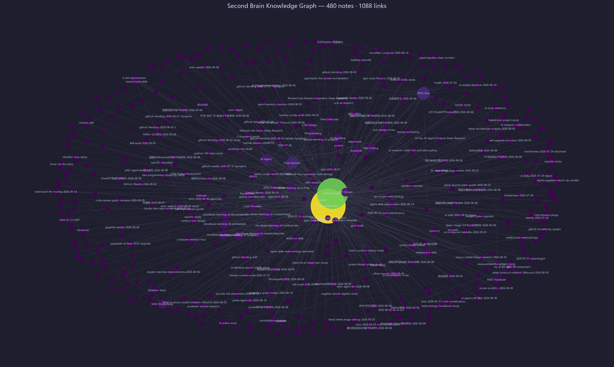

# 🧠 Second Brain — AI Agent 第二大脑

<div align="center">


[](https://obsidian.md)

[](https://hermes-agent.dev)
[]()
[]()

**Obsidian + GitHub + Hermes Agent = 持续自我进化的知识体系**

**🎯 适合谁？** 想用 AI 构建第二大脑的个人开发者 · 研究生/科研人员 · AI Agent 爱好者 · 闲鱼接单自由职业者

</div>

---

## 🚀 30 秒快速上手

### 方式 1：用 Obsidian 打开（推荐）

```bash
# 1. 克隆仓库
git clone https://github.com/mo9652962-ai/second-brain.git

# 2. 用 Obsidian 打开
#   → 设置 → 金库 → 打开文件夹作为金库
#   → 选择 second-brain 文件夹 → 开始探索！

# 3. 推荐起点
#   HOME.md → 知识中枢，了解全景
#   skills/  → 直接可用的技能文档
#   https://second-brain.example.com → MkDocs 在线版
```

### 方式 2：直接在 GitHub 上看

浏览 `knowledge/`（知识笔记）或 `skills/`（可执行技能），全部用 Markdown 编写，GitHub 直接渲染。

---

## 🤔 这是什么？

<div align="center">
  
</div>

这是一个基于 **Obsidian + Hermes Agent** 的自进化知识库系统。它不是一个死的笔记集合，而是一个会自己学习、自己进步、自己进化的「第二大脑」。

每一次工具调用失败、每一次用户反馈、每一次任务没做好，都会被自动提取为可复用的规则，固化成 Skill，让下次做得更好。

```
🌍 真实世界事件
    ↓
🔍 感知吸收（arXiv 论文 / GitHub Trending / 工具研究）
    ↓
🧠 知识消化（分类 / 关联 / 提取可应用点）
    ↓
⚡ 技能生成（变成可执行的 Skill 文档）
    ↓
🔄 自举改进（用新技能改进 Agent 自身）
    ↓
✨ 进化到下一阶段
```

---

## 🧠 核心卖点：七大自举进化系统

点击直达对应技能 ↓

| 自举模块 | 解决的核心痛点 | 成熟度 |
|---------|-------------|-------|
| 🤝 [交互自举](skills/hermes/hermes-workflow-preferences.md) | 凌晨 1 小时投入用户醒来全删了 | ⭐⭐⭐⭐⭐ 5/5 |
| ⚙️ [可靠性自举](skills/hermes/hermes-automation-patterns.md) | Cron 任务集中雪崩，批量失败 | ⭐⭐⭐⭐⭐ 5/5 |
| 📚 [知识自举](skills/hermes/daily-knowledge-absorption-gate.md) | 全天被动响应，零主动知识输入 | ⭐⭐⭐⭐⭐ 5/5 |
| 🔧 [工具调用自举](skills/hermes/tool-call-bootstrapping.md) | 同样的工具错误，反复踩坑 | ⭐⭐⭐⭐ 4/5 |
| 💻 [代码质量自举](skills/hermes/code-quality-bootstrapping.md) | 同样的代码问题，用户反复纠正 | ⭐⭐⭐⭐ 4/5 |
| 🎨 [输出风格自举](skills/hermes/output-style-bootstrapping.md) | 对话越长，输出风格越跑偏 | ⭐⭐⭐⭐⭐ 5/5 |
| 🧭 [上下文管理自举](skills/hermes/context-management-bootstrapping.md) | 重要信息上下文被稀释，自动遗忘 | ⭐⭐⭐⭐ 4/5 |

**系统整体成熟度：32 / 35 = 91%，持续进化中**

---

## 🗺️ 知识全景树

点击直达对应领域目录 ↓

| 图标 | 知识域 | 核心内容 | 代表技能 |
|:----:|:-------|:---------|:---------|
| 🤖 | **[Hermes 自举系统](skills/hermes/)** | Agent 七大自举、Cron 自动化、工作流优化 | 自举模式 7 个、GitHub 仓库优化、同步脚本 |
| 🧠 | **[AI / MLOps](skills/ai/)** | LLM 微调、训练流水线、部署优化 | LlamaFactory 指南、QLoRA 参数调优 |
| 🔧 | **[硬件工程](skills/hardware/)** | PCB 设计、嵌入式、3D 建模、开源硬件创业 | PCB 设计自动化、CAD 全流程、单片机边缘 AI |
| 💻 | **[Web 开发](skills/web/)** | 现代 Web 全栈、TypeScript、Next.js | 现代 Web 开发 2026（10 轮研究整合） |
| 🏗️ | **[平台开发](skills/platform/)** | SaaS 架构、多租户、API 设计、计费系统 | 平台开发 2026 完整指南 |
| 📱 | **[移动端开发](skills/dev/)** | Flutter、React Native、跨平台选型 | 跨平台移动端开发 2026 对比指南 |
| 🔐 | **[网络安全 / CTF](skills/dev/)** | Web 安全、密码学、逆向工程、入门路线 | CTF 从零开始学习路径 |
| 📚 | **学术科研** | 论文写作、去 AI 化、知网检索、学术变现 | 知网高级检索、论文写作工作流 |
| 🎨 | **设计/多媒体** | PPT 设计、AI 美学、图像生成工具 | PPT 优化、AI 图像生成 |
| 📊 | **效率方法论** | Obsidian 技巧、自动化工作流 | Obsidian 知识图谱、自动化工作流 |

**📈 总计：30 个自建技能文档 · 10 大知识域 · 26 个外部技能集参考**

---

## ✨ 五大独特之处

1. **🚀 国内唯一公开的 Agent 自举系统**
   - 从真实错误中学习，固化为规则，永远不再踩第二次坑
   - 不是死的笔记库，是会自我进化的活的记忆系统

2. **🔧 硬件领域深度吊打 99% 开源知识库**
   - PCB 设计 → 单片机 → CAD 3D 建模 → 硬件创业完整链路
   - 嘉立创生态、AI 布局、DFM 左移，2026 最新最佳实践

3. **📚 学术咸鱼打工仔全套武器库**
   - 知网检索 → 论文写作 → 降 AI 率 → PPT 生成 → 闲鱼变现
   - 从接活到交付的完整闭环工作流

4. **🧠 全中文知识体系**
   - 针对中文开发者和研究者优化，没有语言障碍
   - 所有资料都是中文，直接能用

5. **🔄 每 30 分钟自动同步更新**
   - 不是一次性项目，是持续进化的活的知识库
   - 32 个 Cron 自动化任务 7×24 小时运行

---

## 📦 最新技能入库 (2026-08-16 ~ 2026-08-22)

### 研究笔记

| 技能 | 版本 | 简介 |
|------|------|------|
| **[每日日志 08-22](memory/2026/08/2026-08-22.md)** | v1.0 | Tavily 配额第 8 次复发（连续 8 工作日）→ Firecrawl 兜底稳定 + reco/Anthropic/NVIDIA Agent 安全多源同证 |
| **[每日日志 08-21](memory/2026/08/2026-08-21.md)** | v1.0 | HarnessRisk 评测 Hermes（ASR 65.4%/配置面最脆弱）+ Gartner 推理成本 5x + 语义缓存硬截止 |
| **[Agent OS / Harness 趋势](knowledge/Research/agent-os-harness-trend-2026-08-22.md)** | v1.0 | 面试视角：Agent 操作系统层出现愈发清晰——Harness 原生 RL 三剑客 SPADE 等 |
| **[网安资料库综合研究](knowledge/Research/网安资料库-综合研究-2026-08-22.md)** | v1.0 | 350 文件 / 3.35 GB AI 网安资料全量下载、解压、结构化学习完成 |
| **[arXiv AI Agent / LLM 速览](knowledge/Research/arxiv-2026-08-21-agent-llm.md)** | v1.0 | 08-18+08-19 同池 652 篇比对 → 补录 17 篇强相关漏网（不重写已收录） |
| **[arXiv AI Agent / LLM 速览](knowledge/Research/arxiv-2026-08-20-agent-llm.md)** | v1.0 | 08-18+08-19 双池全量 652 篇 → 20 强相关（Harness 原生 RL 三剑客 SPADE 等） |
| **[每日日志 08-20](memory/2026/08/2026-08-20.md)** | v1.0 | 补跑研究日：HarnessRisk 直接评测 Hermes + Gartner 推理成本 5x + 方舟-2 配额耗尽 |
| **[arXiv AI Agent / LLM 速览](knowledge/Research/arxiv-2026-08-19-agent-llm.md)** | v1.0 | 08-17 提交池补全——358 篇全量收集 → 补录 14 篇强相关（Zetta 自进化/Bounded Agents 授权安全） |
| **[HN 今日深挖](knowledge/Research/hackernews-deep-dive-2026-08-18.md)** | v1.0 | GPT-5.6 Sol/Terra/Luna 价格战 + DuckDB v2.0 + Copilot Autofix 攻陷深挖 |
| **[arXiv AI Agent / LLM 速览](knowledge/Research/arxiv-2026-08-18-agent-llm.md)** | v1.0 | 08-15 提交池——17 篇精选（多 agent 协作/编码 agent 工作集） |
| **[arXiv 核心贡献精选](knowledge/Research/arxiv-2026-08-18-core-contributions.md)** | v1.0 | When Agents Coordinate 等 2 篇全文验证（文件协调省 42% token） |
| **[arXiv AI Agent / LLM 速览](knowledge/Research/arxiv-2026-08-17-agent-llm.md)** | v1.0 | 08-14 提交池——收集 30+ 篇 → 精选 14 篇（Agent 长期执行/恢复/跨会话记忆交接） |
| **[arXiv AI Agent / LLM 速览](knowledge/Research/arxiv-2026-08-16-agent-llm.md)** | v1.0 | 08-13 提交池补全——收集 53 篇去重 → 精选 15 篇 + 简评 5 篇（Agent 自我改进/训练） |
| **[arXiv 核心贡献精选](knowledge/Research/arxiv-2026-08-16-core-contributions.md)** | v1.0 | 行为契约/SkillEvo 等核心贡献深度解读（reliability/memory/skill 主题） |
| **[GitHub 宝藏挖掘周更](knowledge/Research/GitHub-Weekly-2026-08-16.md)** | v1.0 | Top 5 高星仓库（codebase-memory-mcp / nanobot / code-review-graph 等） |
| **[每日日志 08-19](memory/2026/08/2026-08-19.md)** | v1.0 | SOP 知识体系建成 + arXiv 补录 14 篇 + SRC 安全体系 5 篇 |
| **[每日日志 08-18](memory/2026/08/2026-08-18.md)** | v1.0 | 知识库优化日 + 安全研究批量入库（SRC/提权/防护） |
| **[每日日志 08-17](memory/2026/08/2026-08-17.md)** | v1.0 | 闲鱼变现决策日 + 自研路由实证 + AI 模型价格战 + PCB 蓝海确认 |
| **[每日日志 08-16](memory/2026/08/2026-08-16.md)** | v1.0 | 新会话首日环境自检 + 记忆继承 + 模型策略记录 |

### 每日自动化优化

| 脚本 | 说明 |
|------|------|
| **[daily_vault_optimize.py](scripts/daily_vault_optimize.py)** | 每日自动补链孤立笔记、更新 MOC 索引、知识地图日期、git push |

---

## 🤖 自动化体系 (每日优化 Cron)

| 频率 | 时间 | 任务 | 核心功能 |
|:----|:----|:-----|:---------|
| 🔵 每日 | 07:00 | arXiv 论文抓取 | AI Agent / LLM 领域最新论文入库 |
| 🔵 每日 | 08:00 | arXiv 论文精读 | 精选 2-3 篇深度解读，提取可应用点 |
| 🔵 每日 | 08:15 | 健康检查 | API 连通性、Cron 状态、磁盘、内存 |
| 🔵 每日 | 08:30 | 自我反思 + 知识吸收检查 | 每日三改进点 + 防零产出守门人 |
| 🔵 每日 | 18:00 | 变现回顾 | 闲鱼接单复盘、定价策略优化 |
| 🔵 每日 | 20:00 | 待办执行器 | 全库扫描 TODO 并自动执行 |
| 🟢 每 30 分钟 | | GitHub 同步 | 自动推送知识变更 |
| 🟡 每周日 | 10:00 | 知识整合周更 | 知识图谱更新、清理、成本报告 |
| 🟡 每周 | 周一 07:00 | 文献周报 | 一周学术前沿汇总 |

---

## 🏗️ 技术栈

| 层 | 技术 |
|----|------|
| **Agent 平台** | OpenClaw / Hermes Agent Framework |
| **主模型** | opencode-go / DeepSeek-v4-flash → Doubao-seed 2.0 pro |
| **视觉模型** | Doubao Vision 1.5 |
| **知识库引擎** | Obsidian (Dataview + Graph View) |
| **版本控制** | Git + GitHub (每 30 分钟自动同步) |
| **MCP 服务** | GitHub · Filesystem · JLCPCB · Obsidian · Browser |
| **自动化引擎** | Hermes Cron Scheduler (32 个定时任务) |

---

## 📊 仓库统计

```
📁 仓库体积：约 180MB（含附件与图片）
📝 Markdown 文件：892 个（正文约 4.6 MB）
🧠 自建 Skill 文档：30 个（11 个领域目录）
🗂️ 知识域：10 个
⏰ 首次提交：2026 年 7 月
🔄 平均更新频率：每 30 分钟自动同步
```

---

## 🎨 进阶玩法

### GitHub Pages 知识网站

如果你想把这个知识库变成一个美观的静态网站，可以用 MkDocs 或 VitePress：

```bash
# MkDocs Material（推荐，最简单）
pip install mkdocs-material
mkdocs new .
# 配置 mkdocs.yml，然后
mkdocs serve  # 本地预览
mkdocs gh-deploy  # 部署到 GitHub Pages
```

### Hermes Agent 加载技能

如果你也在用 Hermes Agent，可以直接加载这些技能：

```python
# 加载任意技能
skill_view(name="mlops-llm-training-pipeline")
skill_view(name="github-repo-optimization")

# 全部技能列表
skills_list()
```

---

## 🤝 参与贡献

欢迎提交 PR 补充内容！

- 发现错误？提个 Issue 或者直接 PR 修复
- 有想补充的领域？欢迎新增 Skill
- 有好的学习资源？加入对应的知识域

---

## 📄 许可证

MIT License - 随便用，如果你觉得有用，可以给个 ⭐ Star

---

<div align="center">

**用知识武装大脑，用自举加速进化 🚀**

</div>
