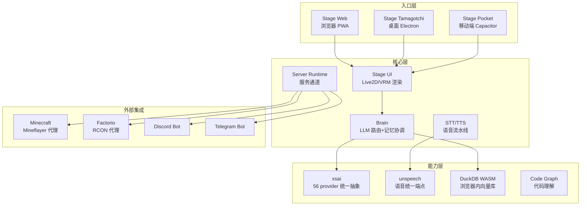
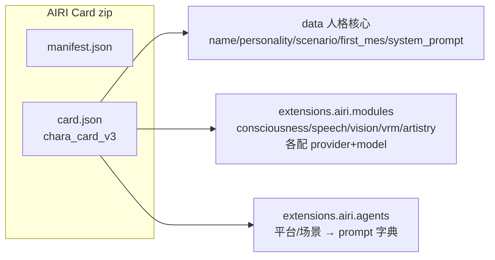

# AIRI 开源数字生命评估

> 来源：抖音 @代码侦探《属于你的开源AI角色 AIRI》→ [moeru-ai/airi](https://github.com/moeru-ai/airi)（⭐44.8k / 4.5k forks, MIT）
> 评估：k · 2026-08-23 · 实证：本地 clone D:\airi（5199 文件）+ 源码研读 + 在线 demo

## 结论置顶

**AIRI 是「AI 数字生命容器」——开源复刻 Neuro-sama 的完整体系**（44.8k⭐ 说明赛道认可）。对我们不是替代 Hermes（文本 Agent），而是**AI 人设/数字形象研究的顶级对标物**。⭐⭐⭐⭐ 值得收藏研究，暂不部署（等 B 站 AI 角色方向明确再说）。

## 项目速览

| 项 | 值 |
|:---|:---|
| GitHub | moeru-ai/airi · ⭐44.8k / 4.5k forks · MIT |
| 定位 | 自托管 AI 伴侣/VTuber「灵魂容器」，复刻 Neuro-sama |
| 核心能力 | 实时语音（VAD+STT+LLM+TTS）、玩 Minecraft/Factorio、Live2D/VRM 形象、30+ LLM |
| 技术栈 | Vue3+TS、pnpm monorepo、WebGPU/WebAudio/WASM、DuckDB WASM 记忆、CCV3 角色卡 |
| 平台 | Web(PWA) / macOS / Windows / 移动端 |
| 子项目 | xsai（AI SDK）/ unspeech（语音）/ webai-realtime-voice-chat / airi-factorio 等 15+ |

## 关键架构图

## 角色卡体系（CCV3）——最值得借鉴

**三层拆分 = 人格核心 + 模块配置 + 行为智能体**——与 SOUL.md 对比及借鉴详见 `AIRI-三核心技术深研-CCV3记忆xsai-2026.md`

## 评估维度

| 维度 | 评分 | 说明 |
|:---|:---|:---|
| 开源质量 | ⭐⭐⭐⭐⭐ | MIT + 44.8k⭐ + 活跃社区 + 15+ 子项目 |
| 技术完整性 | ⭐⭐⭐⭐⭐ | Web/桌面/移动全平台 + 语音 + 游戏 + 记忆 |
| 对 sora 价值 | ⭐⭐⭐⭐ | 人设研究对标 + B 站选题 + 墨题技术参考 |
| 部署成本 | ⭐⭐⭐ | pnpm monorepo 较大；Node 23+ 要求；语音需配 API |
| 成熟度 | ⭐⭐⭐ | 核心稳定，游戏/记忆 Alaya 仍 WIP |

## 与我们体系的定位

- **互补不是竞争**：AIRI=数字形象容器（形象+语音+游戏），Hermes=文本 Agent（工具+文件+编排）
- **记忆互补**：AIRI 浏览器端（DuckDB WASM）vs 我们服务端（TencentDB）——单用户隐私 vs 多 Agent 共享
- **可借鉴**：CCV3 角色卡格式（技能已更新）、xsai 56-provider adapter 模式（墨题多模型）、DuckDB 向量记忆（墨题本地化）

## 下一步

- [ ] B 站 AI 角色方向立项 → 部署 AIRI 试跑（Node 23+ / pnpm）
- [ ] 墨题多模型重构 → 参考 xsai adapter 模式
- [ ] 口语音频 → 参考 webai-realtime-voice-chat
- [ ] 内容选题：AI 玩游戏（Minecraft/Factorio 代理演示）

## 参考

- 在线 demo：https://airi.moeru.ai（预览窗格可体验）
- 官方文档：https://airi.moeru.ai/docs
- 本地源码：D:\airi
- 深研报告：knowledge/AI/AIRI-三核心技术深研-CCV3记忆xsai-2026.md
