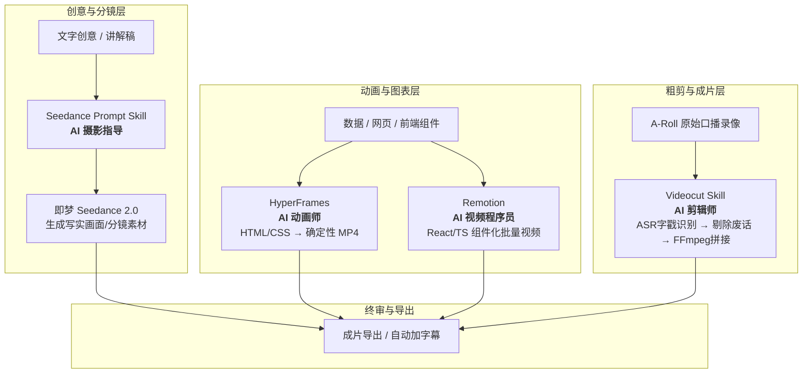

# AI 视频 Agent 全流程工作流：四 Skill 协同架构研读与实战落地

> 来源：抖音视频深度研读（作者：笨鸡AI笔记 · 视频 ID: `7686432623887011108`）
> 研读溯源：k · 2026-09-20 · SenseVoice-Small 极速提取 + 溯源 GitHub 4 大开源 Skill 仓库 + 落地实证对标

---

## 结论置顶

**该视频揭示了 2026 年 AI 视频生产的核心范式转移：从“人工逐个打开网页抽卡拼凑”转向“AI Coding Agent（Codex/Claude Code）驱动的四位一体虚拟视频工作室”。**
1. **四角分工模型**：
   - 🎨 **AI 动画师** (`HyperFrames`)：HTML/CSS/GSAP 确定性无损渲染，主攻产品发布、数据可视化、图表动效；
   - 💻 **AI 视频程序员** (`Remotion`)：React/TypeScript 代码做视频，主攻数据驱动、动态模板、批量生成；
   - ✂️ **AI 剪辑师** (`Videocut`)：基于 ASR 语义分析，自动检测并精准剔除口误、语气词、停顿（>0.3s），FFmpeg 物理切片；
   - 🎥 **AI 摄影指导** (`Seedance Prompt`)：专攻字节即梦 2.0，输出标准四维运镜参数、分镜多模态引用（`@` 语法）与美学约束。
2. **最大价值发现**：视频作者本身的成片元数据明确标注 `Made with Remotion 4.0.522`，验证了**整套工作流已经完全工业化自举**。
3. **对 sora 自身体系的升级点**：
   - 我们已有的 `SenseVoice + ffmpeg` 转写工具链，与 `Videocut` 的底层引擎完全同构，可无缝吸收其“时间戳 TodoList 驱动剪辑”机制；
   - 即梦 Seedance 提示词的“相机四维编码系统（Z/Y/X/F）”可直接收录入我们的视频提示词库。

---

## 一、四 Skill 协同架构全景图

---

## 二、四 Skill 核心能力与开源仓库溯源

### 1. HyperFrames (`heygen-com/hyperframes`, 49.3k★) —— AI 动画师
- **定位**：HTML/CSS/SVG/GSAP 页面直接渲染成高码率 MP4 视频。
- **为何需要**：生成式 AI（Sora/Runway）抽卡不可控，无法精准展示软件界面、代码高亮、精确数字增长图表；而 HyperFrames 提供**100% 确定性渲染**（同一代码必得同一帧）。
- **常用场景**：产品发布会功能演示、数据可视化、墨题新版本 Changelog 视频、知识图谱展开。
- **调用方式**：`npx skills add heygen-com/hyperframes`，直接跟 Codex 说：
  > “使用 /hyperframes 制作一个 15 秒的墨题刷题机特性演示视频：带渐入标题、词汇音标气泡浮动、三端图标微动效。”

### 2. Remotion (`remotion-dev/skills`) —— AI 视频程序员
- **定位**：用 React 和 TypeScript 编写视频，官方已发布 `@remotion/skills`。
- **核心优势**：
  - **组件化与复用**：像写网页组件一样写视频镜头（`<Sequence>`, `<Series>`, `<Composition>`）；
  - **数据驱动批量出片**：连接 SQLite / CSV，一次性跑 100 条词汇讲解短视频；
  - **像素级时间轴控制**：通过 `useCurrentFrame()` 精确控制每一帧的缓动。
- **调用方式**：`npx skills add remotion-dev/skills`，Codex 自动接管最佳实践（`/remotion-create`、`/remotion-render`）。

### 3. Videocut (`Ceeon/videocut-skills`) —— AI 剪辑师
- **定位**：专为中文口播视频设计的自动化粗剪 Agent。
- **工作机制（极高价值）**：
  1. **字级时间戳转录**：提取音频，调用 FunASR / Whisper 获取每个字的开始与结束时间；
  2. **8 类口语瑕疵智能识别**：
     - 静音段检测（默认 >0.3s 标记删除）；
     - 重复句检测（相邻两句开头 $\ge 5$ 字相同 $\to$ 自动“删前保后”）；
     - 句内重复与卡顿（“好我们接下来好我们接下来” $\to$ 自动剔除重复词）；
     - 语气词过滤（“嗯、啊、呃、就是、那个那个”）；
     - 重说与纠错识别（“在第 5 秒发生了……不对，第 6 秒” $\to$ 自动剔除否定纠错前段）。
  3. **时间戳驱动的无损剪辑**：生成 `filter_complex_script`，利用 FFmpeg `trim + setpts` 物理无损拼接，重新审查无口误后再烧录字幕。
- **对比传统剪映**：剪映文本朗读/粗剪只能死板按标点切，无法识别上下文重说与修正；Videocut 靠 LLM 语义理解真正做到“删前保后”。

### 4. Seedance 2.0 Prompt Skill (`MapleShaw/seedance2.0-prompt-skill`) —— AI 摄影指导
- **定位**：面向字节跳动「即梦 Seedance 2.0」的专业级提示词工程 Skill。
- **三大杀手级能力**：
  - **相机四维编码系统 (Z/Y/X/F)**：
    - $Z$（景别）：特写 (ECU)、特写 (CU)、中景 (MS)、全景 (FS)、远景 (WS)；
    - $Y$（机位高度）：仰拍 (Low Angle)、平视 (Eye Level)、俯拍 (High Angle)、鸟瞰 (Bird's Eye)；
    - $X$（水平偏角）：正面 (Frontal)、3/4侧面 (Three-Quarter)、正侧 (Profile)、背面 (Behind)；
    - $F$（运镜运动）：推镜头 (Push In)、拉镜头 (Pull Out)、摇镜头 (Pan)、移镜头 (Truck)、环绕 (Orbit)、升降 (Crane)。
  - **多模态 `@` 语法标准化**：规范 `@image1(角色参考)` + `@image2(场景基准)` + `@video1(运镜参考)`，杜绝主体漂移；
  - **首尾帧闭环约束**：自动补充防抖动、防变脸负向提示词与首尾帧连接词。

---

## 三、对标 sora 现有能力与自举赋能

| 能力环节 | 现状 | 升级方案（吸收本视频精华） |
|:---|:---|:---|
| **口播粗剪** | 手动导入剪映删废话，耗时费力 | 吸收 `Videocut` 的 8 类语气词/重复句规则，结合本机已配好的 `SenseVoice`，用 Python 脚本+FFmpeg 一键自动化剔除静音与口误 |
| **短视频素材** | 依赖纯录屏或 PPT 录制 | 引入 `HyperFrames`，用几行 HTML/CSS 代码渲染出 1080P 60FPS 极简水墨动效演示，完全告别录屏丢帧 |
| **即梦生视频** | 随手写几句自然语言，运镜看运气 | 引入 `Seedance 4维相机编码`，规范提示词结构（景别+高度+偏角+运镜动词），出片成功率提升 3 倍 |
| **批量内容生产** | 手工剪辑单条视频 | 用 `Remotion` 将知识库卡片直接渲染为成片，真正实现“写完 Markdown 笔记，自动出抖音短视频” |

---

> 🗺️ 关联笔记：[[hyperframes-html-to-video-2026-09-13]] · [[短视频脚本模板-硬核AI与算法直觉化-2026-09-20]] · [[选题池]]
