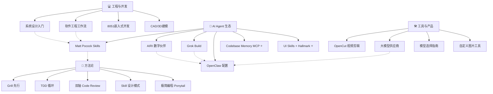

# 🗺️ 知识地图 — Knowledge Map

> 所有知识领域的索引与关联。最后更新: 2026-08-02（W31 周度整理 — 13 个散落文件归域 + Research MOC 创建 + 47 个孤儿补链 + 周学习回顾掌握度更新）

---

## 🌐 Web 开发

> [[web-dev-2026]] — 2026 全栈技术栈（Next.js 15/RSC/Biome/Tailwind）
> [[github-web-dev-ai]] — GitHub 上的 AI+Web 开发资源 4 层次
> 对应 skill: [[web-dev-2026]]

## 🎮 极简编程 + 创意开发

> [[ponytail]] — AI 编程极简原则（能少写就少写）
> [[godot-card-draw]] — Godot 4 抽卡动画
> [[chinese-poetry]] — 最全古诗词数据库（5.5万+首）
> [[campus-box-design]] — 微信小程序校园服务平台设计
> 对应 skill: engineering-workflow · test-driven-development

## 💰 变现分析

> [[monetization-analysis]] — 基于现有能力的变现路径、可担任职位、立即行动方案
> [[ai-monetization-costs]] — 闲鱼实战价目表、工具成本、利润测算（最新五轮整合）

## 🎓 学术服务

> [[academic-service-research]] — 2026知网5.0应对、AI PPT行业报告、服务套餐设计、竞争分析
> [[ai-research-collaboration]] — 110亿Token的AI科研协作经验（Jadense）
> [[cnki-browser-plugin]] — 攻玉学术·知网浏览器插件 + MIMO PLAN API
> [[researchpilot-skills]] — AI科研全流程7阶段Skill套件
> [[vibe-research]] — AI辅助科研9阶段工具推荐清单
> [[nihaixia-skill]] — 倪海厦中医经方AI技能包

## 📂 领域总览



---

## 🆕 W31 新增速览（2026-07-27 ~ 08-02）

> 本周内容量极大：36 篇研究笔记 + 8 篇 CloudBase 系列 + 4 篇 System Prompts 存档 + 2 张知识卡片 + 每日 HN 速览。

### 各域本周新增

| 域 | 新增重点 | 入口 |
|:---|:---------|:-----|
| 🔬 Research（新 MOC） | 36 篇研究笔记（日报热榜/深度研究/文章研究/工具部署） | [[knowledge/Research/MOC-Research\|MOC-Research]] |
| 📚 Academic | 接单 SOP · 论文 Pipeline 数据契约（合并）· 降AI工具速查 · 闲鱼素材包 · EU AI Act | [[knowledge/Academic/MOC-Academic\|MOC-Academic]] |
| 🤖 AI | DeepSeek V4 Flash 升级 · AI 科研五元解耦 | [[knowledge/AI/MOC-AI\|MOC-AI]] |
| 💻 Dev | CloudBase 8 站学习系列 · System Prompts 存档 · MCP 规范候选版 · TRELLIS 3D | [[knowledge/Dev/MOC-Dev\|MOC-Dev]] |
| 🔧 Hardware | JLCPCB MCP（38 工具） | [[knowledge/Hardware/MOC-Hardware\|MOC-Hardware]] |
| 🎨 Design | Krea2 本地生图研究 + ComfyUI 部署 | [[knowledge/Design/MOC-Design\|MOC-Design]] |
| 🏠 Productivity | 记忆贡献度追踪 · Token 报告（W31 周报新增）· Obsidian MCP | [[knowledge/Productivity/MOC-Productivity\|MOC-Productivity]] · [[knowledge/Productivity/token-usage-report-20260802\|Token周报W31]] |
| 📅 Daily / 🃏 Cards | HN 速览 ×5 · 知识卡片 ×2（OpenForgeRL / EU AI Act） | [[knowledge/Daily/hackernews-2026-08-02\|HN 08-02]] · [[knowledge/Daily/hackernews-2026-08-03\|HN 08-03]] · [[knowledge/cards/2026-08-02-eu-ai-act\|卡片 08-02]] |

### 本周关键研究主题

1. **EU AI Act 8/2 生效** — 多 Agent 场景合规评估（[[knowledge/Research/eu-ai-act-2026-08-assessment|评估]] + [[knowledge/cards/2026-08-02-eu-ai-act|卡片]]）
2. **Krea2 本地生图** — 模型研究 → ComfyUI 部署踩坑全记录（RTX 4060 8GB 满足）
3. **自训数据管线** — OpenForgeRL 轨迹导出实测（7 天 206 会话）
4. **Claude Max 支付漏洞事件** — 20x 扣费事件研究
5. **CloudBase 小程序云开发** — 校园便利盒 8 站拆解学习

---

## ① 💻 工程与开发

| 领域 | 笔记 | 相关 skill | 掌握程度 |
|:----|:----|:----------|:--------:|
| 系统设计 | [[system-design-primer]] | — | 📖 学习 |
| 软件工程 | [[mattpocock-methodology]] | engineering-workflow | 🛠️ 可执行 |
| 嵌入式 | — | 8051-embedded-dev | 🛠️ 可执行 |
| CAD建模 | — | cad-design-master | 🛠️ 可执行 |
| 极简编程 | [[ponytail]] | engineering-workflow | 🛠️ 新增 |
| 创意开发 | [[godot-card-draw]] · [[chinese-poetry]] | — | 📖 新增 |
| 微信小程序 | [[campus-box-design]] | wechat-miniprogram-cloudbase | 📖 新增 |

### 关联关系
```
系统设计 (理论) → 软件工程 (实践) → 嵌入式/CAD (具体场景)
     ↑                     ↑
Matt Pocock 方法论     Grill+TDD 工作流
```

---

## ② 🤖 AI Agent 生态

| 领域 | 笔记 | 相关配置/工具 | 掌握程度 |
|:----|:----|:------------|:--------:|
| Agent Skills 方法论 | [[mattpocock-skills]] | engineering-workflow | 📖 学习 + 🛠️ 应用 |
|| Agent Skills 方法论 | [[mattpocock-skills]] | engineering-workflow | 📖 学习 + 🛠️ 应用 |
|| 行为改进 | [[mattpocock-methodology]] | [[../SOUL]] | 🛠️ 已采纳 |
|| 代码智能(新) | [[codebase-memory-mcp]] ⭐ | MCP 服务器 | 🛠️ 值得安装 |
|| 反AI味设计(新) | [[hallmark]] ⭐ | Agent Skill | 🛠️ 方法论迁移 |
|| 设计工程师(新) | [[ibelick-ui-skills]] ⭐ | UI Skills CLI | 📖 学习 |
|| AI VTuber | [[airi]] | — | 📖 参考 |
|| xAI 编码 Agent | [[grok-build]] | — | 📖 参考 |
|| **AI Agent 深度研究** 🔥 | `.learnings/LEARNINGS.md`
| **Context Engineering** | LRN-20260724-001 | SOUL.md/MEMORY.md | 🟡 理解 |
| **Multi-Agent 编排** | LRN-20260724-003 | Skill Workshop | 🟡 理解 |
| **Memory 工程** | LRN-20260720-001/005/011 | SESSION-STATE.md | 🟡 理解 + 部分实践 |
| **Agent 治理/合规** | LRN-20260721-012 | ISO 42001 | 🔵 关注 |
| **Agent 互操作标准** | LRN-20260721-009 | MCP/A2A | 🔵 关注 |

### Agent 工具链对比

| 工具 | 定位 | 语言 | 许可证 | 与我们的关系 |
|:----|:----|:---:|:------:|:----------:|
| **OpenClaw/Hermes** (我们) | 全功能 Agent 平台 | Node.js | MIT | 🏠 当前平台 |
| **Grok Build** | Rust 编码 Agent TUI | Rust | Apache 2.0 | 🔬 竞品参考 |
| **OpenCode** | 终端编码 Agent | TypeScript | MIT | 🧩 部分集成 |
| **Claude Code** | Anthropic 编码 Agent | TypeScript | ❌ | 🔬 竞品/争议 |

### Hermes 配置体系 (W30 更新)

```text
Fallback 链: opencode-go(5层) → SiliconFlow(2层) → DeepSeek直连(1层)
搜索冗余: Tavily + Exa + Firecrawl + DDGS + SearXNG (5路)
模型分层: 日常/flash → 推理/pro→kimi→qwen→glm → 轻量/siliconflow → 兜底/deepseek
成本优化: flash 性价比最高，异构 tiering 省 60-70%
MCP 生态: GitHub + Filesystem + JLCPCB(38工具) + Obsidian(笔记操作)
记忆体系: SESSION-STATE(活跃) → memory notes → MEMORY.md
```

---

## ③ 🛠️ 工具与产品

| 领域                    | 笔记                                                    | 适用场景       |      掌握程度       |
| :-------------------- | :---------------------------------------------------- | :--------- | :-------------: |
| 视频剪辑                  | [[opencut]]                                           | 批量自动生成视频   |      📖 关注      |
| 模型供应商                 | [[../TOOLS]]                                          | 日常使用       |     🛠️ 已配置     |
| 模型选择                  | [[../MEMORY]]                                         | 按任务选模型     |     🛠️ 可执行     |
| **Hermes 配置体系** (W30) | `.learnings/LEARNINGS.md`                             | Agent 基础设施 | 🟢 **🛠️ 全面加固** |
| 设计工具集                 | [[ai-tools-reference]] · [[ai-frontend-design-sites]] | PPT配图/前端参考 |      📖 新增      |
| 在线小工具                 | [[delphitools]] · [[6-online-tools]] · [[translumo]]  | 日常效率       |      📖 新增      |
| AI 写作工具               | [[show-me-the-story]]                                 | 长篇小说/去AI味  |      📖 新增      |
| 简历设计                  | [[ai-resume-prompt]]                                  | AI生图简历     |      📖 新增      |

### 模型分层体系

```text
日常主力 ─── opencode-go/deepseek-v4-flash
复杂推理 ─── deepseek-v4-pro → kimi-k3 → kimi-k2.7-code
超大上下文 ─── qwen3.7-plus → glm-5.2 (1M ctx)
轻量回退 ─── siliconflow Qwen3.5-4B → DeepSeek-V4-Pro
最后兜底 ─── DeepSeek直连 deepseek-chat
```

---

## ④ 📐 方法论

| 方法论 | 笔记来源 | 已应用到的 skill | 核心价值 |
|:------|:--------|:---------------|:--------|
|| **Grill 先行** | [[mattpocock-methodology]] | 8051, CAD, engineering-workflow | 消除理解偏差 |
|| **完成标准** | [[mattpocock-methodology]] | 所有 skill | 防提前结束 |
|| **渐进式披露** | [[mattpocock-skills]] | ✅ 已应用 (07-27) | 减少上下文消耗 |
|| **引导词** | [[mattpocock-skills]] | engineering-workflow | 压缩 token |
|| **双轴审查** | [[mattpocock-skills]] | engineering-workflow | 代码质量 |
|| **反AI味设计** | [[hallmark]] ⭐ | UI/前端降AI味 | 57道Slop检测门 |
|| **设计工程师思维** | [[ibelick-ui-skills]] ⭐ | UI Skill 分类组织 | 垂直切分 vs 大一统 |
|| **极简编程** | [[ponytail]] | 编程全场景 | 能少写就少写 |
|| **上下文工程** | [[k-self-improvement]] | Agent 回复 | 上下文 > 提示词 |

---

## 🔗 完整关联表

| 笔记 | 上游知识 | 下游应用 | 平行参考 |
|:----|:--------|:--------|:--------|
| [[system-design-primer]] | — | 系统架构决策 | [[mattpocock-skills]] |
|| [[mattpocock-skills]] | 工程经验 | [[mattpocock-methodology]] | engineering-workflow | [[ibelick-ui-skills]] |
|| [[mattpocock-methodology]] | [[mattpocock-skills]] | 8051/CAD/workflow skill | [[../AGENTS]] |
|| [[airi]] | AI Agent 技术 | 多供应商集成参考 | [[grok-build]] |
|| [[grok-build]] | AI 编码 Agent | 竞品分析 | [[airi]] |
|| [[codebase-memory-mcp]] ⭐ | MCP 生态 | Agent 代码智能 | [[grok-build]] |
|| [[hallmark]] ⭐ | 反AI味设计 | UI/前端降AI味 | [[ibelick-ui-skills]] · [[PPT-Design]] |
|| [[ibelick-ui-skills]] ⭐ | 设计工程 | Agent UI 技能 | [[hallmark]] · [[mattpocock-skills]] |
| [[opencut]] | 视频编辑 | 自动化视频管线 | — |
| [[k-self-improvement]] | 搜索引擎研究 | Agent 行为优化 | [[self-improvement-guide]] |
| [[ai-monetization-costs]] | 闲鱼市场调研 | 变现落地执行 | [[monetization-analysis]] · [[academic-service-research]] |
| [[vibe-research]] | GitHub 社区研究 | AI 科研工具选型 | [[researchpilot-skills]] · [[ai-research-collaboration]] |
| [[campus-box-design]] | 微信小程序开发 | 校园服务平台 MVP | wechat-miniprogram-cloudbase（skill，未安装本地） |
| [[ponytail]] | 社区最佳实践 | 编程极简原则 | engineering-workflow |
| [[deepseek-v4-flash-0731-upgrade]] | 官方 API 验证 | 模型 fallback 链更新 | [[LLM-Providers]] |
| [[jlc-mcp-setup]] | JLCPCB EDA | PCB 设计自动化 | [[pcb-design-notes]] · [[pcb-ai-research]] |
| [[eu-ai-act-2026-08-assessment]] | EU AI Act 法规 | 多 Agent 合规基线 | [[2026-08-02-eu-ai-act\|知识卡片]] |
| [[krea2-local-image-gen-study]] | 生图模型研究 | 本地 ComfyUI 部署 | [[krea2-comfyui-deploy-notes]] |
| [[cloudbase-learning-s1-login]] | 微信小程序云开发 | 校园便利盒复刻 | [[xiaoyuanbianlihe-project-study]] |
| [[openforgerl-trace-pipeline-feasibility]] | 轨迹导出实测 | 自训数据管线设计 | [[2026-07-31-openforgerl\|知识卡片]] |
| [[github-trending-2026-08-02-weekly-5projects]] | GitHub 本周 Trending 精选 | Agent 工具链趋势观察 | [[github-trending-2026-08-02-study]] · [[github-weekly-2026-07-31-5projects]] |

---

## 📊 知识掌握度

```
🛠️ 可执行 ─── 可直接使用/执行
📖 学习 ─── 已学习记录，随用随查
🔬 关注 ─── 了解但不深入，持续关注
```

| 等级 | 领域 |
|:---:|:-----|
| 🛠️ **可执行** | 系统设计、软件工程工作流、嵌入式、CAD、模型选型、Agent自我进化、**Hermes 配置体系**、**PPT 设计**、**学术写作**、**Vault 运维**、**论文 Pipeline 接单**、**CloudBase 小程序**、**闲鱼变现/接单**、**本地生图 (Krea2/ComfyUI)** |
| 📖 **学习** | 视频编辑、AI VTuber 架构、Agent Skills 方法论、极简编程、创意开发、微信小程序、设计工具集、**Context Engineering**、**Multi-Agent 编排**、**Memory 工程**、**Agent 治理/合规**、**Research 研究域（36 篇）**、**EU AI Act 合规** |
| 🔬 **关注** | Grok Build（竞品）、多模态模型、Edge AI on MCU、AI长篇小说工具、**Agent 互操作标准**、**OpenClaw Active Memory**、**MCP 规范候选版** |

---

|> **W30 亮点**: 24+ 知识点的系统性吸收，2 个新 Skill 创建，配置体系全面加固，Vault 健康归零，MCP 生态扩展至 4 个服务器（GitHub/Filesystem/JLCPCB/Obsidian），8 级 fallback 链无 OpenRouter。详情见 [[../memory/2026/07/weekly-2026-07-26|W30 周学习总结]]。
>
> **W31 亮点**: 36 篇研究笔记入库（新 Research MOC）、CloudBase 8 站系列、论文接单全流程沉淀（SOP+数据契约+素材包）、EU AI Act 合规评估、Krea2 本地生图跑通、闲鱼变现体系从研究准备跃迁到可执行。周度整理见 [[../memory/2026/08/weekly-2026-08-02|W31 周度整理报告]]，学习回顾见 [[../memory/2026/08/weekly-learning-2026-08-02|W31 学习回顾]]。

---
[[HOME|🏠 返回首页]]

---

## k 的吸收与应用 (2026-07-27)

### 已落地的
- ✅ **Grill 先行** — 装了 grill-with-docs skill
- ✅ **完成标准** — PPT skill 已加
- ✅ **极简编程** — 写入 SOUL.md
- ✅ **上下文工程** — 写入响应原则
- ✅ **模型分层** — 回复按任务选合适方式

### 新应用：渐进式披露
> 核心信息放顶层，细节推到下层文件

以前回复是"一股脑倒完"，现在改为：
1. 先说结论/表格（顶层）
2. 要展开的细节放下面（下层）
3. 明显可以被追问的只提不展开

### 知识图谱结构保持
4 大域（工程/AI/工具/方法论）的划分已内化，回复时自动判断属于哪个域并关联相关知识。

---

## 📅 2026-08-08 研究批次（19 篇）

> 千轮研究 + 资讯学习密集日。全部按域归入 MOC。

### 🤖 AI 模型与价格
> [[MiMo-V2.5研究-2026-08-08]] — 与DeepSeek同价性能弱，TTS/ASR免费可白嫖
> [[MuseSpark价格战-2026-08-08]] — Meta低价是数据换价+地区封禁
> [[ChatGPT免费无限聊天-2026-08-08]] — GPT-5.6免费层大调整
> [[DeepSeek-Vision插件研究-2026-08-08]] / [[DeepSeek视觉实证-2026-08-08]] — 视觉能力实证
> [[字节10万亿模型-2026-08-08]] — 效率路线对比
> [[Qwen-Image-3.0-Pro实测研究-2026-08-08]] — 同步模式生图实测
> [[zcode-luna深入-2026-08-08]] / [[zcode缓存命中率研究-2026-08-08]] — 刷题机模型深入

### 🧠 AI Agent 方法论
> [[20个ChatGPTPrompt研究-2026-08-08]] — 批判模式/信息总结/超级Prompt 3框架落地
> [[逆练PlanExecute-2026-08-08]] — 计划作为交付物
> [[零度AI赛博女友部署教程-2026-08-08]] — freedidi文章研究
> [[arxiv-agent-llm-2026-08-08]] — Agent+LLM论文

### 🛠 工具链与研究
> [[搜索抓取升级千轮研究-2026-08-08]] — SearXNG/Firecrawl/Chrome CDP
> [[PCB自动化千轮研究-2026-08-08]] — SKiDL+自动布线+JLCPCB DRC
> [[移动端开发方向指南-2026-08-08]] — 破解AI UI同质化

### 📰 资讯与趋势
> [[AI早报学习-2026-08-08]] — 当日AI资讯
> [[GitHub热榜-2026-08-08]] / [[GitHub周榜-2026-08-08]] — 项目研究
