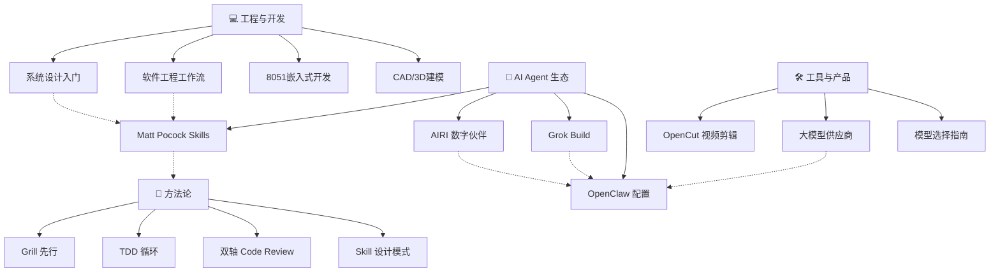

# 🗺️ 知识地图 — Knowledge Map

> 所有知识领域的索引与关联。最后更新: 2026-07-22

---

## 🌐 Web 开发

> [[web-dev-2026]] — 2026 全栈技术栈（Next.js 15/RSC/Biome/Tailwind）
> [[github-web-dev-ai]] — GitHub 上的 AI+Web 开发资源 4 层次
> 对应 skill: [[../skills/web-dev-2026]]

## 💰 变现分析

> [[monetization-analysis]] — 基于现有能力的变现路径、可担任职位、立即行动方案

## 🎓 学术服务

> [[academic-service-research]] — 2026知网5.0应对、AI PPT行业报告、服务套餐设计、竞争分析

## 📂 领域总览



---

## ① 💻 工程与开发

| 领域 | 笔记 | 相关 skill | 掌握程度 |
|:----|:----|:----------|:--------:|
| 系统设计 | [[system-design-primer]] | — | 📖 学习 |
| 软件工程 | [[mattpocock-methodology]] | [[engineering-workflow]] | 🛠️ 可执行 |
| 嵌入式 | — | [[8051-embedded-dev]] | 🛠️ 可执行 |
| CAD建模 | — | [[cad-design-master]] | 🛠️ 可执行 |

### 关联关系
```
系统设计 (理论) → 软件工程 (实践) → 嵌入式/CAD (具体场景)
     ↑                     ↑
Matt Pocock 方法论     Grill+TDD 工作流
```

---

## ② 🤖 AI Agent 生态

| 领域 | 笔记 | 相关配置/工具 | 掌握程度 |
|:----|:----|:------------|:--------:|
| Agent Skills 方法论 | [[mattpocock-skills]] | [[engineering-workflow]] | 📖 学习 + 🛠️ 应用 |
| 行为改进 | [[mattpocock-methodology]] | [[../SOUL]] | 🛠️ 已采纳 |
| AI VTuber | [[airi]] | — | 📖 参考 |
| xAI 编码 Agent | [[grok-build]] | — | 📖 参考 |

### Agent 工具链对比

| 工具 | 定位 | 语言 | 许可证 | 与我们的关系 |
|:----|:----|:---:|:------:|:----------:|
| **OpenClaw** (我们) | 全功能 Agent 平台 | Node.js | MIT | 🏠 当前平台 |
| **Grok Build** | Rust 编码 Agent TUI | Rust | Apache 2.0 | 🔬 竞品参考 |
| **OpenCode** | 终端编码 Agent | TypeScript | MIT | 🧩 部分集成 |
| **Claude Code** | Anthropic 编码 Agent | TypeScript | ❌ | 🔬 竞品 |

---

## ③ 🛠️ 工具与产品

| 领域 | 笔记 | 适用场景 | 掌握程度 |
|:----|:----|:--------|:--------:|
| 视频剪辑 | [[opencut]] | 批量自动生成视频 | 📖 关注 |
| 模型供应商 | [[../TOOLS]] | 日常使用 | 🛠️ 已配置 |
| 模型选择 | [[../MEMORY]] | 按任务选模型 | 🛠️ 可执行 |

### 模型分层体系

```
心跳/内部 ─── mimo-v2.5 ─── $0.14/$0.28
日常主力 ─── deepseek-v4-flash ─── $0.14/$0.28
复杂推理 ─── deepseek-v4-pro → kimi-k3
免费兜底 ─── OpenRouter 免费模型 ─── $0
多模态 ─── minimax-m3 / gemma-4:free
```

---

## ④ 📐 方法论

| 方法论 | 笔记来源 | 已应用到的 skill | 核心价值 |
|:------|:--------|:---------------|:--------|
| **Grill 先行** | [[mattpocock-methodology]] | 8051, CAD, engineering-workflow | 消除理解偏差 |
| **完成标准** | [[mattpocock-methodology]] | 所有 skill | 防提前结束 |
| **渐进式披露** | [[mattpocock-skills]] | 待改进 | 减少上下文消耗 |
| **引导词** | [[mattpocock-skills]] | engineering-workflow | 压缩 token |
| **双轴审查** | [[mattpocock-skills]] | engineering-workflow | 代码质量 |

---

## 🔗 完整关联表

| 笔记 | 上游知识 | 下游应用 | 平行参考 |
|:----|:--------|:--------|:--------|
| [[system-design-primer]] | — | 系统架构决策 | [[mattpocock-skills]] |
| [[mattpocock-skills]] | 工程经验 | [[mattpocock-methodology]] | [[engineering-workflow]] |
| [[mattpocock-methodology]] | [[mattpocock-skills]] | 8051/CAD/workflow skill | [[../AGENTS]] |
| [[airi]] | AI Agent 技术 | 多供应商集成参考 | [[grok-build]] |
| [[grok-build]] | AI 编码 Agent | 竞品分析 | [[airi]] |
| [[opencut]] | 视频编辑 | 自动化视频管线 | — |

---

## 📊 知识掌握度

```
🛠️ 可执行 ─── 可直接使用/执行
📖 学习 ─── 已学习记录，随用随查
🔬 关注 ─── 了解但不深入，持续关注
```

| 等级 | 领域 |
|:---:|:-----|
| 🛠️ 可执行 | 系统设计、软件工程工作流、嵌入式、CAD、模型选型 |
| 📖 学习 | 视频编辑、AI VTuber 架构、Agent Skills 方法论 |
| 🔬 关注 | Grok Build（竞品）、多模态模型、Edge AI on MCU |

---

> **下一步**: 可以按需深入某个领域，或将某个「学习」等级的知识提升为「可执行」。

---
[[HOME|🏠 返回首页]]
