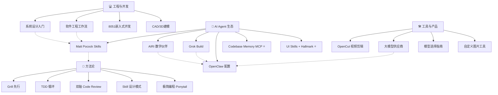

# 🗺️ 知识地图 — Knowledge Map

> 入口: [[Home|🏠 Home]] · 返回总索引

> 机器版索引: [[VAULT-MAP|🗺️ VAULT-MAP]]（AI 导航）· 健康看板: [[DASHBOARD|📊 DASHBOARD]] · 新陈代谢: [[METABOLISM|🌿 METABOLISM]]

> 所有知识领域的索引与关联。最后更新: 2026-09-20（W39 GitHub 周榜 5 项入库 + 周报更新）

## 🧭 MOC 总入口（2026-08-16 起，新建 MOC 必须在此挂载）

| 域 / 主题切片 | 入口 | 规模 |

|:---|:---|:---|

| 🔬 Research（域） | [[MOC-Research]] | 220 篇 |

| 🐙 GitHub 研究（主题切片） | [[MOC-GitHub]] | 58 篇 |

| 🛡️ 网络安全（主题切片） | [[MOC-Security]] | 53 篇 |

| 💻 Dev（域） | [[MOC-Dev]] | 137 篇 |

| 🔧 Hardware（域） | [[MOC-Hardware]] | 21 篇 |

| 🏠 Productivity（域） | [[MOC-Productivity]] | 52 篇 |

| 🧭 入口治理 | [[MOC-Inbox]] | 53 篇待接入笔记 |

| 🔁 重复审阅 | [[MOC-Duplicate-Review]] | 0 组逐字重复；相似标题按时间/用途保留 |

| 📈 Finance（域） | [[MOC-Finance]] | 16 篇 |
| 🃏 知识卡片 | [[knowledge/cards/MOC-cards|MOC-cards]] | 35 篇 |
| 📅 每日产出 | [[knowledge/Daily/MOC-Daily|MOC-Daily]] | 32 篇 |
| 🤖 AI 研究与生态 | [[knowledge/AI/MOC-AI|MOC-AI]] | 18 篇 |
| 📋 标准操作流程 | [[knowledge/SOP/MOC-SOP|MOC-SOP]] | 9 篇 |
| 🎓 教育规划 | [[knowledge/Education/MOC-Education|MOC-Education]] | 1 篇 |
| 🎨 创意创作 | [[knowledge/Creative/MOC-Creative|MOC-Creative]] | 5 篇 |
| 📦 产品 | [[knowledge/Product/MOC-Product|MOC-Product]] | 1 篇 |
| 🎮 游戏研究 | [[knowledge/gaming/MOC-gaming|MOC-gaming]] | 3 篇 |
| 🗄️ 归档 | [[knowledge/Archive/MOC-Archive|MOC-Archive]] | 2 篇 |

> 主题切片 MOC（如 GitHub/安全）横跨多个目录收拢同主题笔记，域 MOC 管目录、主题 MOC 管切片，双层导航。

> 重构总体方案见 知识库重构方案(已删)；孤立/重复扫描：`python scripts/vault-orphan-duplicate-scan.py --scope knowledge`

---

## 🌐 Web 开发

> [[web-dev-2026]] — 2026 全栈技术栈（Next.js 15/RSC/Biome/Tailwind）

> [[github-web-dev-ai]] — GitHub 上的 AI+Web 开发资源 4 层次

> 对应 skill: [[web-dev-2026]]

## 🎮 极简编程 + 创意开发

> [[ponytail]] — AI 编程极简原则（能少写就少写）

> [[godot-card-draw]] — Godot 4 抽卡动画

> [[chinese-poetry]] — 最全古诗词数据库（5.5万+首）

> [[campus-box-design]] — 微信小程序校园服务平台设计

> [[knowledge/gaming/bannerlord-upgrade-plan-2026-08-20|bannerlord-upgrade-plan]] — 骑砍2 升级计划（e1.4.7→v2 路线）

> [[knowledge/gaming/bannerlord-gemini-loadout-2026-08-20|bannerlord-gemini-loadout]] — 骑砍2 Gemini 配装研究

> 对应 skill: engineering-workflow · test-driven-development

## 💰 变现分析

> [[monetization-analysis]] — 基于现有能力的变现路径、可担任职位、立即行动方案

> [[ai-monetization-costs]] — 闲鱼实战价目表、工具成本、利润测算（最新五轮整合）

## 🎓 学术服务

> [[academic-service-research]] — 2026知网5.0应对、AI PPT行业报告、服务套餐设计、竞争分析

> [[ai-research-collaboration]] — 110亿Token的AI科研协作经验（Jadense）

> [[cnki-browser-plugin]] — 攻玉学术·知网浏览器插件 + MIMO PLAN API

> [[researchpilot-skills]] — AI科研全流程7阶段Skill套件

> [[vibe-research]] — AI辅助科研9阶段工具推荐清单

> [[nihaixia-skill]] — 倪海厦中医经方AI技能包

> [[knowledge/AI/数模国赛-AI提示词库-2026|数模国赛 AI 提示词库]] — 26 国赛必备提示词（云顶数模 08-23 整理）

## 📂 领域总览



---

## 🆕 W31 新增速览（2026-07-27 ~ 08-02）

> 本周内容量极大：36 篇研究笔记 + 8 篇 CloudBase 系列 + 4 篇 System Prompts 存档 + 2 张知识卡片 + 每日 HN 速览。

### 各域本周新增

| 域 | 新增重点 | 入口 |

|:---|:---------|:-----|

| 🔬 Research（新 MOC） | 36 篇研究笔记（日报热榜/深度研究/文章研究/工具部署） | [[knowledge/Research/MOC-Research]] |

| 📚 Academic | 接单 SOP · 论文 Pipeline 数据契约（合并）· 降AI工具速查 · 闲鱼素材包 · EU AI Act | [[knowledge/Research/MOC-Research]] |

| 🤖 AI | DeepSeek V4 Flash 升级 · AI 科研五元解耦 | [[knowledge/Dev/MOC-Dev]] |

| 💻 Dev | CloudBase 8 站学习系列 · System Prompts 存档 · MCP 规范候选版 · TRELLIS 3D | [[knowledge/Dev/MOC-Dev]] |

| 🔧 Hardware | JLCPCB MCP（38 工具） | [[knowledge/Hardware/MOC-Hardware]] |

| 🎨 Design | Krea2 本地生图研究 + ComfyUI 部署 | [[knowledge/Hardware/MOC-Hardware]] |

| 🏠 Productivity | 记忆贡献度追踪 · Token 报告（W31 周报新增）· Obsidian MCP | [[knowledge/Productivity/MOC-Productivity]] · [[knowledge/Productivity/token-usage-report-20260802]] |

| 📅 Daily / 🃏 Cards | HN 速览 ×5 · 知识卡片 ×2（OpenForgeRL / EU AI Act） |  ·  · [[knowledge/cards/2026-08-02-eu-ai-act]] |

### 本周关键研究主题

1. **EU AI Act 8/2 生效** — 多 Agent 场景合规评估（[[knowledge/Research/eu-ai-act-2026-08-assessment|评估]] + [[knowledge/cards/2026-08-02-eu-ai-act|卡片]]）

2. **Krea2 本地生图** — 模型研究 → ComfyUI 部署踩坑全记录（RTX 4060 8GB 满足）

3. **自训数据管线** — OpenForgeRL 轨迹导出实测（7 天 206 会话）

4. **Claude Max 支付漏洞事件** — 20x 扣费事件研究

5. **CloudBase 小程序云开发** — 校园便利盒 8 站拆解学习

---

---

## 🆕 W32 新增速览（2026-08-03 ~ 08-09）

> 本周主线：刷题机迭代（S4MP/竞品fork/模型实测）+ PCB 自动化双轨闭环 + arXiv 论文周报 + 千轮研究密集落地。

### 各域本周新增

| 域 | 新增重点 | 入口 |

|:---|:---------|:-----|

| 🔬 Research | 22+ 篇研究笔记（S4MP 协议/PCB 千轮/AI 模型实测/移动端方向） | [[knowledge/Research/MOC-Research]] |

| 📚 arXiv（归域） | arxiv-weekly×6 + core-contributions×2 从 research/ 顶层迁入，命名统一 | [[knowledge/Research/arxiv-weekly-2026-08-05]] |

| 🤖 AI | DeepSeek V4 Flash ARC Prize 登顶（89.0%）· 模型实测矩阵（MiMo/MuseSpark/Qwen-Image） | [[knowledge/cards/2026-08-09-deepseek-v4-flash-arc-prize]] |

| 💻 Dev（归域） | hermes-mcp-architecture 从 research/ 迁入 · codebase-memory-mcp | [[knowledge/Dev/hermes-mcp-architecture]] |

| 🔧 Hardware | 嘉立创自动化问题根因（版本 2.x vs 3.x）· SKiDL 网表双轨闭环 · PCB EMC/SI/热设计 | [[knowledge/Hardware/MOC-Hardware]] |

| 🃏 Cards | 知识卡片 ×7（协议版本协商/SESA/零内存/深度求索/ARC Prize） | [[knowledge/cards/2026-08-09-deepseek-v4-flash-arc-prize]] |

| 📅 Daily | HN 速览 ×7（08-03 ~ 08-09） | [[knowledge/Daily/hackernews-2026-08-09]] |

### 本周关键研究主题

1. **S4MP/SimSync 联机协议** — 100 轮网络协议 + 商业模式仿制 + 拓扑审查（[[knowledge/Research/s4mp-protocol-network-100round-2026-08-05|协议研究]]）

2. **PCB 自动化双轨闭环** — SKiDL 网表（KiCad10 导入 EasyEDA 不丢网络）+ 嘉立创官方 Run API Gateway（[[knowledge/Research/双轨闭环路线图-SKiDL网表-2026-08-08|路线图]]）

3. **arXiv 周报归域** — arxiv-weekly×6 从 research/ 顶层迁入 knowledge/Research/，命名与 core-contributions 统一

4. **DeepSeek V4 Flash 外部背书** — ARC Prize 登顶（89.0%/$0.02），验证生产默认模型选型

5. **移动端开发方向** — 破解 AI UI 同质化（截图回归 + 全界面遍历 + 竖屏独立布局）

---

## 🆕 W33 新增速览（2026-08-10 ~ 08-14）

> 本周主线：GitHub 热榜全新面孔（自改进 RLM Agent 领跑 +12k⭐）+ ACL 2026 自我进化五篇 + 刷题机竞品两轮落地 + W33 API 成本根因闭环。学习回顾见 [[../memory/2026/08/weekly-learning-2026-08-14|W33 学习回顾]]。

### 各域本周新增

| 域 | 新增重点 | 入口 |

|:---|:---------|:-----|

| 🔬 Research | GitHub-Weekly-W33（prime-agent/semantica/agent-skills/cloudflare-computer/switchyard）+ arXiv 18 篇速览 + ACL 2026 五篇合成 + 竞品研究第1轮 | [[knowledge/Research/GitHub-Weekly-2026-08-14]] · [[knowledge/Research/arxiv-2026-08-14-agent-llm]] |

| 🤖 AI | **Prime Agent RLM**（+12,476⭐/周，与 Hermes 一一对应）· Semantica 图原生（PROV-O provenance） | [[knowledge/Dev/prime-agent-rlm-2026-08-14]] · [[knowledge/Dev/semantica-graph-native-2026-08-14]] |

| 💻 Dev | addyosmani agent-skills（四原则+链接门禁）· Switchyard 路由网关 · Cloudflare computer 沙箱 | [[knowledge/Dev/agent-skills-addyosmani-2026-08-14]] · [[knowledge/Dev/switchyard-llm-routing-2026-08-14]] |

| 📊 成本 | W33 API 成本报告（glm-5.2 兜底异常 ¥55 + CNY/USD 记账 bug 修正） | [[knowledge/Productivity/token-usage-report-20260814]] |

| 🃏 Cards | 知识卡片 ×2（ACL 自我进化 / Prime Agent RLM） | [[knowledge/cards/2026-08-13-agent-self-evolution-acl2026]] · [[knowledge/cards/2026-08-14-prime-agent-rlm]] |

| 📅 Daily | HN 速览 ×3（08-07 补 / 08-12 / 08-13 / 08-14） | [[knowledge/Daily/hackernews-2026-08-14]] |

### 本周关键研究主题

1. **自改进 RLM Agent 主战场** — Prime Agent（RLM + Continual Harness + /refine 可回滚自改进）与 Hermes memory/skills/cron/subagent 一一对应（[[knowledge/Dev/prime-agent-rlm-2026-08-14|研究]] + [[knowledge/cards/2026-08-14-prime-agent-rlm|卡片]]）

2. **Agent 自我进化范式转变 (ACL 2026)** — SkillDAG/SkillGen/SkillSmith/COVE/AgeMem 五篇：技能图+反模式记忆+工具协同+量化验证（[[knowledge/cards/2026-08-13-agent-self-evolution-acl2026|卡片]]）

3. **刷题机竞品两轮** — Android 版千轮（响应式/底部导航/更新清单）+ 第2轮落地 19/19（AI 文章练词/听力精听/快捷键/标注 100%）

4. **W33 成本根因闭环** — 供应商故障链 → glm-5.2 高价兜底 + 记账口径 bug（CNY 记 USD 虚高 7 倍）

5. **知识链 17→12 域整合** — arXiv/writing-material/Python/Tools/Content 并入主域，MOC 更新

---

## 🆕 W35 新增速览（2026-08-17 ~ 08-18）

> 本周主线：SRC 挖洞/渗透安全批量入库（8 篇）+ 去 AI 味技能研究 + Lossless Scaling 游戏工具 + 墨题巡检。

| 域 | 新增重点 | 入口 |

|:---|:---------|:-----|

| 🛡️ Security | SRC 挖洞/提权渗透/防御加固/DVWA 靶场/逻辑漏洞 ×8 | [[knowledge/Security/MOC-Security]] |

| 🎨 Creative | 去 AI 味开源技能研究（小黑盒帖子 + 千轮研究） | [[knowledge/Creative/de-ai-skills-2026-08-18]] |

| 📅 Daily | HN 速览补链（08-08/08-16）· 今日产出学习 | [[knowledge/Daily/hackernews-2026-08-16]] · [[knowledge/Daily/hackernews-2026-08-08]] · [[knowledge/Daily/daily-output-study-2026-08-18]] |

| 🎮 Gaming | Lossless Scaling（无损缩放/小黄鸭）研究 | [[knowledge/gaming/lossless-scaling-2026-08-18]] |

| 💻 Dev | 墨题每日巡检 08-18 | [[knowledge/Dev/墨题每日巡检-2026-08-18]] |

---

## 🆕 W35 续（2026-08-19 ~ 08-22 批量入库）

> 网安资料库收官 + SRC 自动化 + SOP 知识体系 0→1 + 后端开发坑系列 32 项 + 千轮增强六域。整理报告见 [[../memory/2026/08/weekly-2026-08-23|W35 周度整理]]。学习回顾见 [[../memory/2026/08/weekly-learning-2026-08-23|W35 学习回顾]]。

| 域 | 新增重点 | 入口 |

|:---|:---------|:-----|

| 🛡️ Security | SRC 自动化三工具/联想侦察/OSINT/网安自学路线 + 校园便利盒挖洞实战 + 墨题安全自审/防破解 + 手机木马 RAT 攻防 ×26 | [[knowledge/Security/MOC-Security]] |

| 📜 SOP | SOP 知识体系 0→1：7 篇 SOP + 5 维 Schema + 演进日志 | [[knowledge/SOP/SOP-INDEX]] |

| 🔬 Research | 网安资料库综合研究（350 文件/3.35GB）+ agent-os-harness 趋势 | [[knowledge/Research/网安资料库-入口]] · [[knowledge/Research/agent-os-harness-trend-2026-08-22]] |

| 💻 Dev | 后端开发坑系列 32 项（写码前扫坑清单）+ 墨题巡检 08-17/20/21 + Gemini Spark 指南 | [[knowledge/Dev/写码前扫坑清单]] · [[knowledge/Dev/墨题每日巡检-2026-08-21]] |

| 🧠 META | 技能生产链全景图 + 千轮自我强化 + 沉淀验证与应用 | [[knowledge/META/技能生产链全景图-2026-08-21]] |

| 🔧 Hardware | PCB 2026 KiCad10+AI-EDA + CAD 千轮增强 + AI-PCB 前沿对比 | [[knowledge/Hardware/PCB-2026-KiCad10与AI-EDA]] |

| 🏠 Productivity | 交付成本库 + 报价 4 问 + PPT 2026 千轮增强 + GitHub 变现 | [[knowledge/Productivity/交付成本库]] |

| 🤖 AI | TencentDB Agent Memory 评估（记忆引擎） | [[knowledge/AI/TencentDB-Agent-Memory-评估-2026-08-22]] |

| 📈 Finance | 股票分析千轮研究增强 | [[knowledge/Finance/股票分析-2026-千轮研究增强]] |

| 🎮 Gaming | 骑砍2 升级计划 + Gemini 配装 | [[knowledge/gaming/bannerlord-upgrade-plan-2026-08-20]] |

| 📅 Daily | HN 速览 08-17/18/19/21 | [[knowledge/Daily/hackernews-2026-08-21]] |

| 🎨 Creative/Content | AI 小说流水线 + 网文世界观 + 内容创作 B 站变现 + 去 AI 味 39 类检测 + **GEO 生成式引擎优化** | [[knowledge/Creative/AI小说工厂流水线-2026-08-20]] · [[knowledge/Content/内容创作-2026-B站变现增强]] · [[knowledge/Content/GEO-生成式引擎优化-研究-2026]] |

---

## 🆕 W36 新增速览（2026-08-24 ~ 08-30）

> 本周主线：Vibe Coding / Agent 工作流方法论批量入库（Context Engineering / SDD / AI-native 组件库）+ 联合工作 v1.3 升级（Antigravity 程序化接入）+ 数模 Agent 生态实证 + 量化交易缠论系统。整理报告见 [[../memory/2026/08/weekly-2026-08-31|W36 周度整理]]。

| 域 | 新增重点 | 入口 |

|:---|:---------|:-----|

| 🏠 Productivity | Vibe Coding 系列（要不要学代码/小程序拆解/应用追踪表）+ 手搓万物→顶级开发师 + AI-native 组件库 + 团队上下文注入包 + Context Engineering ×7 | [[knowledge/Productivity/MOC-Productivity]] |

| 🔬 Research | 多 Agent 协作增强千轮研究 + 联合工作 v1.3（Antigravity 程序化）+ ai-weekly-literature + arXiv 08-31 + GitHub-Weekly 08-30 | [[knowledge/Research/MOC-Research]] |

| 📈 Finance | 量化交易：缠论 + Codex + 50亿 token 落地 | [[knowledge/Finance/量化交易-缠论Codex-50亿token-2026-08-30]] |

| 🔧 Hardware | ESP32S3 万年历 AI 开发 + 对标借鉴：治具自动出图（DRC 生产门禁 + Golden Sample） | [[knowledge/Hardware/MOC-Hardware]] |

| 🃏 cards | Anthropic 封订阅 token / 数据源验证经验 | [[knowledge/cards/2026-08-30-data-source-verification]] |

| 📅 Daily | HN 速览 08-24 / 08-31 | [[knowledge/Daily/hackernews-2026-08-31]] |
| 📅 Daily | HN 速览 09-08 | [[knowledge/Daily/hackernews-2026-09-08]] |

---

## 🆕 W37 新增速览（2026-08-31 ~ 09-06）

> 本周主线：墨题上云/公网部署落地（无 Docker 方案 + Vercel/CDN/域名全流程）+ 闲鱼运营千轮研究（推流算法点击率分层）+ 工具精度方法论（假阳性税，反哺 knowledge-lint）+ 多 Agent Eval 基线 v2（20 查询）。整理报告见 [[../memory/2026/09/weekly-2026-09-06|W37 周度整理]]。

| 域 | 新增重点 | 入口 |
|:---|:---------|:-----|
| 🏠 Productivity | 闲鱼运营千轮研究 09-04 + 运动曲线 easing（动效）+ Vault 健康基线 | [[knowledge/Productivity/MOC-Productivity]] |
| 🛠 Dev | 墨题上云部署方案（无 Docker）+ 网站公网部署全流程（Vercel+CDN+域名）| [[knowledge/Dev/墨题上云部署方案-无Docker-2026-09-02]] |
| 🔬 Research | 多 Agent Eval 基线 v2 + arXiv 09-03/04/05 速览 + 工具精度方法论（假阳性税）| [[knowledge/Research/MOC-Research]] |
| 🔐 Security | hermes-codex-security-policy 09-04 + SRC 批量初筛收敛 | [[knowledge/Security/MOC-Security]] |
| 🤖 AI | 知识库-AI 不翻知识库根因 + 工具精度方法论 | [[knowledge/AI/工具精度方法论-假阳性税与知识库Lint-2026-09-05]] |
| 🃏 cards | 闲鱼运营算法 / 假阳性税知识卡片 | [[knowledge/cards/2026-09-04-xianyu-operation-algorithm]] |

---

## 🆕 W34 新增速览（2026-08-15 ~ 08-16）

> 本周主线：知识域收敛 10→7（08-15 refactor）+ AgentScope 评测资产放量 + 墨题 P0/P1 设计 + harness 十轮强化 + 闲鱼 8/17 决策倒计时。整理报告见 [[../memory/2026/08/weekly-2026-08-16|W34 周度整理]]，学习回顾见 [[../memory/2026/08/weekly-learning-2026-08-16|W34 学习回顾]]。

### 各域本周新增

| 域 | 新增重点 | 入口 |

|:---|:---------|:-----|

| 🤖 Dev | **AgentScope 评测放量**（小君 AI 测评/架构参考 PawBench/深度测试/部署测试 4 篇）+ AI 测评内容素材库 + harness 十轮强化/联合工作 + 墨题 P0/P1 设计稿 + Token 节省千轮研究 + **GitHub Trending 精选 4 篇**（diagram-design 图表/needle 端侧模型/google-skills/code-graph-rag） | [[knowledge/Dev/agentscope-小君AI测评-千轮研究-2026-08-15]] · [[knowledge/Dev/墨题-P0错题AI诊断设计稿-2026-08-15]] · [[knowledge/Dev/diagram-design-2026-08-16]] · [[knowledge/Dev/needle-tiny-model-2026-08-16]] · [[knowledge/Dev/google-skills-2026-08-16]] · [[knowledge/Dev/code-graph-rag-2026-08-16]] |

| 🔬 Research | GitHub-Weekly-08-16 + arXiv 08-16 补全 15 篇（SkillEvo/CrEST/Faraday）+ 研究跟踪器归位 ×3 + 剪映转场教程归位 | [[knowledge/Research/GitHub-Weekly-2026-08-16]] · [[knowledge/Research/arxiv-2026-08-16-agent-llm]] |

| 🧠 人设 | k-soul-persona 2026-08-15 迭代（浓亲密度 + 负面情绪许可 + 口头禅 5 条） | [[knowledge/Dev/k-soul-persona-2026-08-15]] |

| 📈 Finance | 每日股票分析 cron 落地（akshare → DeepSeek → 知识库） | [[knowledge/Finance/每日股票分析-2026-08-15]] |

| 🏗️ 结构 | 知识域 10→7 收敛（Academic→Research、AI→Dev、Design→Hardware）+ dreaming 压平 + 全仓引用修复 | [[knowledge/Cross-Domain]] |

### 本周关键主题

1. **知识域收敛 10→7** — 08-15 大型 refactor：49 篇迁移、MOC 合并、dreaming 三层压平（light/rem/deep → 前缀命名）

2. **AgentScope 评测矩阵** — 小君 AI 千轮测评 + PawBench 架构参考 + 深度测试 + 部署测试四连，沉淀 AI 测评内容素材库

3. **墨题 P0/P1 设计** — 错题 AI 诊断设计稿（12 分类归因）+ AI 服务层架构（3 库模式/DPAPI/降级链）+ career-ops 借鉴

4. **闲鱼 8/17 决策** — P0 上架连续顺延至 8/17 最后期限，素材已 100% 就绪

5. **股票分析 cron 上线** — 每日 18:00 akshare 采集 → DeepSeek 决策报告 → knowledge/Finance/

6. **GitHub Trending 精选** — diagram-design（+14.7k 增长王，无 Mermaid-slop 图表）/ needle（14MB 端侧模型）/ google/skills（Agent Skills 官方生态）/ code-graph-rag（代码图谱 RAG），周报见 [[../memory/2026/08/github-trending-w34|W34 GitHub 周报]]

---

## 🆕 W35 新增速览（2026-08-17 ~ 08-23）

> 本周主线：GitHub 跨厂商 Agent 记忆主线（ai-memory/OpenViking）+ 硬件×模型匹配工具（llmfit）+ 图表赛道连涨（diagram-design 第二周 +8.5k）。周报见 [[../memory/2026/08/github-trending-w35|W35 GitHub 周报]]。

### 各域本周新增

| 域 | 新增重点 | 入口 |

|:---|:---------|:-----|

| 🤖 Dev | **跨 Agent 记忆**（ai-memory：11 agents×75 hooks 统一记忆层，借鉴 Hermes 自改进循环）+ **硬件×模型匹配**（llmfit：MoE 感知估算 + 社区 PR 基准流） | [[knowledge/Dev/ai-memory-cross-agent-2026-08-23]] · [[knowledge/Dev/llmfit-hardware-matching-2026-08-23]] |

### 本周关键主题

1. **跨厂商 Agent 记忆成主线** — ai-memory（+2.4k）/ OpenViking（+3.0k，字节上下文数据库）/ TencentDB 记忆引擎三线并进；ai-memory README 明确借鉴 Hermes Agent 自改进循环

2. **硬件×模型匹配工具化** — llmfit 33.5k：本地推理普及后的选型痛点，MoE 感知估算 + 社区基准数据资产化

3. **图表赛道连续第二周暴涨** — diagram-design 18.9k→25.4k，编辑级图表成主流诉求，与 sora PPT/信息图技能方向一致

4. **周榜新面孔少** — 15 项目中仅 ai-memory、llmfit 未入库，其余全连榜/已覆盖，方向验证为主

## 🆕 W37 GitHub Trending（2026-08-31 ~ 09-06）

> 本周 GitHub Trending 精选 5 项入库：可验证系统图（archify，周增 +19.5k 增长王）/ 多 Agent harness（ECC 250k★）/ 科研 Agent 技能库（scientific-agent-skills）/ 清华多 Agent 课堂（OpenMAIC）/ 本地语音工作台（VoiceStudio）。周报见 [[../memory/2026/09/github-trending-w37|W37 GitHub 周报]]。

| 项目 | ★ / 周Δ | 一句话定位 | 入库笔记 |
|:--|:--|:--|:--|
| **tt-a1i/archify** | 49.9k / +19,480 | 可验证架构图 Agent Skill：typed JSON IR → 确定性编译 + 校验收据 + Before/Delta/After 评审 | [[knowledge/Dev/archify-verifiable-diagrams-2026-09-06]] |
| **affaan-m/ECC** | 250.2k / +5,445 | 多 Agent harness 优化系统：68 agents + 286 skills + AgentShield 安全扫描，覆盖 Codex/Claude/Antigravity | [[knowledge/Dev/ecc-agent-harness-2026-09-06]] |
| **K-Dense-AI/scientific-agent-skills** | 43.0k / +5,491 | 科研 Agent 技能库 #1：165 validated skills + 100+ 数据库，技能库 CI 治理样板 | [[knowledge/AI/scientific-agent-skills-library-2026-09-06]] |
| **THU-MAIC/OpenMAIC** | 32.1k / +10,109 | 清华多 Agent 交互课堂：DSL 场景引擎 + choreography 编排规范 + 确定性时间轴 | [[knowledge/AI/openmaic-multiagent-classroom-2026-09-06]] |
| **debpalash/VoiceStudio** | 19.1k / +6,761 | 全本地 ElevenLabs 替代：语音克隆/视频配音/转写，646 语言 | [[knowledge/AI/voicestudio-local-voice-2026-09-06]] |

### 本周关键主题

1. **可验证/可审计成为 Agent 产物新标准** — archify 的「校验证据链」、ECC 的 AgentShield 安全扫描、scientific-agent-skills 的「validated skills」：同一信号 = 生成物必须带证明，与 sora 质量门禁思路一致
2. **Agent Skills 标准生态成熟** — archify / scientific-agent-skills / patent-disclosure-skill（7.5k★ 中文专利技能）全是 Agent Skill 形态，SKILL.md 单文件 + npx skills add 一键装——sora 的技能体系正处同一标准
3. **多 Agent 编排从 prompt 走向 spec** — OpenMAIC 的 choreography 单一事实源 + 纯解释器，是防多 agent 行为漂移的工程化答案
4. **本地化工具爆发但硬件受限** — VoiceStudio 全本地语音、ECC 多 harness：本地优先趋势明确，但 RTX4060 8GB/16GB 内存是现实瓶颈

---

## 🆕 W39 GitHub Trending（weekly 口径，2026-09-20）

> 本周 GitHub API 断连，数据经 trending 快照 + web_search 多源交叉验证。5 项全部新入库；脚本口径 Top5 仍连榜。周报见 [[../memory/2026/09/github-trending-w39|W39 GitHub 周报]] + [[knowledge/Research/GitHub-Weekly-2026-09-20-weekly-5projects|weekly 详情]]。

| 项目 | ★ / 周Δ | 一句话定位 | 入库笔记 |
|:--|:--|:--|:--|
| **Wei-Shaw/sub2api** | 39.4k / 热榜 | 订阅配额→API Key 分发网关：token 计费 + 内置支付 + 多协议自适应 | [[knowledge/Dev/sub2api-api-gateway-2026-09-20]] |
| **TheoLeeCJ/SemIf** | 1.9k / 4 天 | logits 直读决策概率（Jev 开源复刻）：5x 提速零输出 token | [[knowledge/AI/semif-logit-decisions-2026-09-20]] |
| **Tencent/AI-Infra-Guard** | 6.1k / +525 | 腾讯朱雀 AI 红队：MCP/Skills/Agent/Infra 四层扫描 + 越狱评估 | [[knowledge/Security/ai-infra-guard-2026-09-20]] |
| **multica-ai/andrej-karpathy-skills** | 205k / +21k | 单文件 CLAUDE.md 四原则治 LLM 编码通病 | [[knowledge/Dev/karpathy-coding-guidelines-2026-09-20]] |
| **alibaba/open-code-review** | 21.3k / 增长 | 已在用：确定性+LLM 混合，~1/9 token，Delegation Mode | [[knowledge/Dev/open-code-review-2026-09-20]] |

### 本周关键主题

1. **订阅配额经济升温** — sub2api 全年霸榜（02-28 首登 #1→39.4k★）：把订阅拆成 API 卖成 2026 真实商业模式，与 sora 中转/反代基建同赛道（EasyCLIProxyAPI/WorkBuddy 反代对照）
2. **「决策不走文本生成」新范式** — Jev（闭源）→ SemIf（开源）→ jev-ultrafast（browser-use 应用）：小决策用 logits 概率代替大模型写 JSON，本地 RTX 3090/4060 可跑
3. **AI 安全体检工具化** — Tencent A.I.G + ECC AgentShield + cloudflare/security-audit-skill：MCP/Skills 供应链安全成厂商押注点，第三方 skills 装前可扫
4. **编码 agent 行为约束刚需** — karpathy-skills 205k★：「给成功标准而非指令」+ verify 检查点，与 sora 验证文化同源
5. **专用 agent 跑赢通用 agent** — open-code-review ~1/9 token + 更高 Precision：垂直工具化是 agent 应用效率方向

## 🆕 W38 新增速览（2026-09-07 ~ 09-13）

> 本周主线：三 bot 协作十领域自我强化千轮研究批次（PCB/变现/墨题/边缘AI/CAD/Web/AI安全/自举）+ 黑盒热榜 5 项目实证 + 评测意图隐藏规范 + 技能审计 + arXiv 双窗口速览。整理报告见 [[../memory/2026/09/weekly-2026-09-13|W38 周度整理]]。学习回顾见 [[../memory/2026/09/weekly-learning-2026-09-13|W38 学习回顾]]。

### 各域本周新增

| 域 | 新增 | 要点 |
|:--|:--|:--|
| Research | [[knowledge/Research/2026-09-11-self-study/INDEX\|十领域自我强化研究 09-11]] | 10 报告并行千轮研究：PCB DRC 门禁 / 变现三级火箭 / 墨题 AI 精讲 / 内容工业化图文快变现 / 边缘 AI 流水线 / CAD 双引擎 / Web16 安全基线 / AI 安全 P0 / 自举证据映射 |
| Research | [[knowledge/Research/黑盒热榜5项目实证研究-2026-09-08\|黑盒热榜 5 项目实证 09-08]] | marketingskills 48.2k★ / DeerFlow 81.9k★ / pascal editor 22.4k★ MCP 语义工具层直接参考 / LunaTV 只借技术 / camofox 不引入 |
| Development | [[knowledge/Dev/CAD自动化MCP参考-pascal-2026-09-08\|CAD 自动化 MCP 参考 09-08]] | pascal/editor 31 MCP 语义工具 + headless Core 设计，CAD/PCB 自动化直接范本 |
| META | [[knowledge/META/评测设计规范-意图隐藏-2026-09-09\|评测意图隐藏规范 09-09]] | 被测模型知道被测即改变行为（开战意愿 -13.43 实证），自建基准必遵守 |
| Research | [[knowledge/Research/skill-audit-2026-09-08\|技能审计 09-08]] | 392 技能 / 本月使用 97 / TOP10 cron 自举闭环 + P0 过时技能清单 |
| Research | [[knowledge/Research/GitHub-Weekly-2026-09-08\|GitHub 宝藏 09-08]] | codebase-memory-mcp / nanobot / code-review-graph 等 Top5 |
| Research | [[knowledge/Research/GitHub-Weekly-2026-09-13-weekly-5projects\|GitHub 周榜 W38 weekly 09-13]] | context-mode / WeKnora / hyperframes / no-ai-slop 4 新面孔；archify 59.8k / OpenMAIC 36.2k 连榜更新（周报 [[../memory/2026/09/github-trending-w38|W38 周报]]） |
| arXiv | arxiv-09-07/08/09/10/11 五期速览 | 09-10 索引解冻 1,749 篇 + 09-11 新窗口 441 篇零重叠；Agent 记忆/技能为焦点 |
| Finance | 每日股票分析 09-08/09/11 | A 股盘后分析 ×3 期 |
| cards | 5 张知识卡 | 记忆可移植性 / 黑盒实证 / eval 反应性 / Desert Ant 端侧 / AI 商业广告反面教材 |
| Daily | HN 速览 ×5 | 09-07/08/09/10/13 |
| Daily | HN 速览 09-16（补跑） | [[knowledge/Daily/hackernews-2026-09-16]] |

### 🆕 W38 GitHub Trending（weekly 口径，2026-09-13）

> 脚本口径 Top5（codebase-memory-mcp/nanobot/chrome-devtools-mcp/TrendRadar/ruflo）全连榜无新面孔；weekly 增速榜 4 个真新增。周报见 [[../memory/2026/09/github-trending-w38|W38 GitHub 周报]] + [[knowledge/Research/GitHub-Weekly-2026-09-13-weekly-5projects|weekly 详情]]。

| 项目 | ★ / 周Δ | 一句话定位 | 入库笔记 |
|:--|:--|:--|:--|
| **mksglu/context-mode** | 22.4k / +1,936 | 上下文窗口优化 MCP：沙箱工具输出 98% 减少 + FTS5 索引化不截断 + SQLite 会话记忆 + 17 平台路由 | [[knowledge/Dev/context-mode-context-window-2026-09-13]] |
| **Tencent/WeKnora** | 22.7k / +1,168 | 腾讯开源 LLM 知识平台：RAG + ReAct Agent + 自维护 Wiki + 跨会话记忆（记忆按查询相关度排序，非重要性） | [[knowledge/AI/weknora-knowledge-platform-2026-09-13]] |
| **heygen-com/hyperframes** | 49.3k / +5,124 | Write HTML. Render Video：确定性 MP4 渲染 + 20 agent skills 按需加载 + 组件注册表语义搜索 | [[knowledge/Content/hyperframes-html-to-video-2026-09-13]] |
| **petergyang/no-ai-slop** | 8.7k / +1,307 | 20+ 模式规则化去 AI 味：检测举证不猜 + 保留个人声音，与 39 类检测互补 | [[knowledge/Creative/no-ai-slop-2026-09-13]] |

**连榜更新**：archify 49.9k→59.8k（+10,442）· OpenMAIC 32.1k→36.2k（+4,417）· text-to-cad 12.3K→15.5K（CAD-Design）。

### 本周关键研究主题

1. **多 agent 协作 + 十领域并行研究成为常态** — 09-11 三 bot（研究员/编码员/审核员）协作启动，一次产出 10 份领域报告 + 落地看板；每份含「结论置顶 + 实证数据 + 可执行下一步」
2. **「AI 技能库可测试化」信号强化** — marketingskills 的 evals.json 断言 + product-marketing 上下文原语（48.2k★ 核心原因），与 ai-cmo evals 思路同源
3. **评测反应性成为质量门禁新维度** — 告诉模型在被评估即改变行为 + 意图隐藏规范落地，与 service-quality 评估器审计互补
4. **CAD/PCB 自动化 MCP 化有现成范本** — pascal/editor「语义工具为主 + patch 兜底 + 校验闭环 + 人工交接点」设计可直接迁移 jlc-mcp/KiCad 自动化
5. **arXiv 索引窗口解冻恢复常态速览** — 09-10 解冻 1,749 篇（22+16）→ 09-11 新窗口 441 篇零重叠，HTML list 页路由已验证可用

---

## ① 💻 工程与开发

| 领域 | 笔记 | 相关 skill | 掌握程度 |

|:----|:----|:----------|:--------:|

| 系统设计 | [[system-design-primer]] | — | 📖 学习 |

| 软件工程 | [[mattpocock-methodology]] | engineering-workflow | 🛠️ 可执行 |

| 嵌入式 | — | 8051-embedded-dev | 🛠️ 可执行 |

| CAD建模 | — | cad-design-master | 🛠️ 可执行 |

| 极简编程 | [[ponytail]] | engineering-workflow | 🛠️ 新增 |

| 创意开发 | [[godot-card-draw]] · [[chinese-poetry]] | — | 📖 新增 |

| 微信小程序 | [[campus-box-design]] | wechat-miniprogram-cloudbase | 📖 新增 |

### 关联关系

```

系统设计 (理论) → 软件工程 (实践) → 嵌入式/CAD (具体场景)

     ↑                     ↑

Matt Pocock 方法论     Grill+TDD 工作流

```

---

## ② 🤖 AI Agent 生态

| 领域 | 笔记 | 相关配置/工具 | 掌握程度 |

|:----|:----|:------------|:--------:|

| Agent Skills 方法论 | [[mattpocock-skills]] | engineering-workflow | 📖 学习 + 🛠️ 应用 |

|| Agent Skills 方法论 | [[mattpocock-skills]] | engineering-workflow | 📖 学习 + 🛠️ 应用 |

|| 行为改进 | [[mattpocock-methodology]] | [[../SOUL]] | 🛠️ 已采纳 |

|| 代码智能(新) | [[codebase-memory-mcp]] ⭐ | MCP 服务器 | 🛠️ 值得安装 |

|| 反AI味设计(新) | [[hallmark]] ⭐ | Agent Skill | 🛠️ 方法论迁移 |

|| 设计工程师(新) | [[ibelick-ui-skills]] ⭐ | UI Skills CLI | 📖 学习 |

|| AI VTuber | [[airi]] | — | 📖 参考 |

| AI 生态工具调研 | [[knowledge/AI/AIRI生态-18工具研究-哪些有用-2026\|AIRI 生态 18 工具]] | 墨题 VAD/口语 | 🟢 已落地 |

||| xAI 编码 Agent | [[grok-build]] | — | 📖 参考 |

||| 自改进RLM Agent (W33) | [[prime-agent-rlm-2026-08-14]] ⭐ | memory/skills/cron 自举 | 🟡 关注 |

||| 图原生+可审计 (W33) | [[semantica-graph-native-2026-08-14]] ⭐ | graphify/Obsidian | 🟡 关注 |

||| 生产级技能(W33) | [[agent-skills-addyosmani-2026-08-14]] ⭐ | Hermes skills 治理 | 🟢 参考 |

||| Agent 云电脑 (W33) | [[cloudflare-computer-2026-08-14]] | browser-automation | 🔵 关注 |

||| 编辑级图表 (W34) | [[diagram-design-2026-08-16]] ⭐ | ppt-design/baoyu-infographic | 🟢 参考 |

||| 端侧 14MB 模型 (W34) | [[needle-tiny-model-2026-08-16]] ⭐ | 本地LLM/边缘AI | 🟡 关注 |

||| 记忆引擎评估 (W35) | [[knowledge/AI/TencentDB-Agent-Memory-评估-2026-08-22\|TencentDB Agent Memory 评估]] ⭐ | TencentDB 记忆引擎 | 🟢 已部署 |

||| Google 官方 Skills (W34) | [[google-skills-2026-08-16]] ⭐ | Agent Skills 标准 | 🔵 关注 |

||| 代码图谱 RAG (W34) | [[code-graph-rag-2026-08-16]] | code-review-graph MCP | 🔵 关注 |

|| **AI Agent 深度研究** 🔥 | `.learnings/LEARNINGS.md`

| **Context Engineering** | LRN-20260724-001 | SOUL.md/MEMORY.md | 🟡 理解 |

| **Multi-Agent 编排** | LRN-20260724-003 | Skill Workshop | 🟡 理解 |

| **Memory 工程** | LRN-20260720-001/005/011 | SESSION-STATE.md | 🟡 理解 + 部分实践 |

| **Agent 治理/合规** | LRN-20260721-012 | ISO 42001 | 🔵 关注 |

| **Agent 互操作标准** | LRN-20260721-009 | MCP/A2A | 🔵 关注 |

### Agent 工具链对比

| 工具 | 定位 | 语言 | 许可证 | 与我们的关系 |

|:----|:----|:---:|:------:|:----------:|

| **OpenClaw/Hermes** (我们) | 全功能 Agent 平台 | Node.js | MIT | 🏠 当前平台 |

| **Grok Build** | Rust 编码 Agent TUI | Rust | Apache 2.0 | 🔬 竞品参考 |

| **OpenCode** | 终端编码 Agent | TypeScript | MIT | 🧩 部分集成 |

| **Claude Code** | Anthropic 编码 Agent | TypeScript | ❌ | 🔬 竞品/争议 |

### Hermes 配置体系 (W30 更新)

```text

Fallback 链: opencode-go(5层) → SiliconFlow(2层) → DeepSeek直连(1层)

搜索冗余: Tavily + Exa + Firecrawl + DDGS + SearXNG (5路)

模型分层: 日常/flash → 推理/pro→kimi→qwen→glm → 轻量/siliconflow → 兜底/deepseek

成本优化: flash 性价比最高，异构 tiering 省 60-70%

MCP 生态: GitHub + Filesystem + JLCPCB(38工具) + Obsidian(笔记操作)

记忆体系: SESSION-STATE(活跃) → memory notes → MEMORY.md

```

---

## ③ 🛠️ 工具与产品

| 领域                    | 笔记                                                    | 适用场景       |      掌握程度       |

| :-------------------- | :---------------------------------------------------- | :--------- | :-------------: |

| 视频剪辑                  | [[opencut]]                                           | 批量自动生成视频   |      📖 关注      |

| 模型供应商                 | [[../TOOLS]]                                          | 日常使用       |     🛠️ 已配置     |

| 模型选择                  | [[../MEMORY]]                                         | 按任务选模型     |     🛠️ 可执行     |

| **Hermes 配置体系** (W30) | `.learnings/LEARNINGS.md`                             | Agent 基础设施 | 🟢 **🛠️ 全面加固** |

| 设计工具集                 | [[ai-tools-reference]] · [[ai-frontend-design-sites]] | PPT配图/前端参考 |      📖 新增      |

| 在线小工具                 | [[delphitools]] · [[6-online-tools]] · [[translumo]]  | 日常效率       |      📖 新增      |

| AI 写作工具               | [[show-me-the-story]]                                 | 长篇小说/去AI味  |      📖 新增      |

| 简历设计                  | [[ai-resume-prompt]]                                  | AI生图简历     |      📖 新增      |

| 模型路由网关 (W33)         | [[switchyard-llm-routing-2026-08-14]]                  | 多供应商路由/fallback |    🟡 参考      |

### 模型分层体系

> ⚠️ **2026-09-20 修订**：以下为**历史路线**。当前运行时配置以 [[knowledge/META/current-model-status]] 为准。

```text

日常主力 ─── opencode-go/deepseek-v4-flash  ← 已退役别名，现为 deepseek-flash

复杂推理 ─── deepseek-v4-pro → kimi-k3 → kimi-k2.7-code

超大上下文 ─── qwen3.7-plus → glm-5.2 (1M ctx)

轻量回退 ─── siliconflow Qwen3.5-4B → DeepSeek-V4-Pro

最后兜底 ─── DeepSeek直连 deepseek-chat

```

---

## ④ 📐 方法论

| 方法论 | 笔记来源 | 已应用到的 skill | 核心价值 |

|:------|:--------|:---------------|:--------|

|| **Grill 先行** | [[mattpocock-methodology]] | 8051, CAD, engineering-workflow | 消除理解偏差 |

|| **完成标准** | [[mattpocock-methodology]] | 所有 skill | 防提前结束 |

|| **渐进式披露** | [[mattpocock-skills]] | ✅ 已应用 (07-27) | 减少上下文消耗 |

|| **引导词** | [[mattpocock-skills]] | engineering-workflow | 压缩 token |

|| **双轴审查** | [[mattpocock-skills]] | engineering-workflow | 代码质量 |

|| **反AI味设计** | [[hallmark]] ⭐ | UI/前端降AI味 | 57道Slop检测门 |

|| **设计工程师思维** | [[ibelick-ui-skills]] ⭐ | UI Skill 分类组织 | 垂直切分 vs 大一统 |

|| **极简编程** | [[ponytail]] | 编程全场景 | 能少写就少写 |

|| **上下文工程** | [[k-self-improvement]] | Agent 回复 | 上下文 > 提示词 |

| **SOP 知识体系** | [[knowledge/SOP/SOP-INDEX\|SOP 索引]] | SOP-001~007 | 经验→程序化技能（8-19 建立） |

| **技能生产链** | [[knowledge/META/技能生产链全景图-2026-08-21\|技能生产链全景]] | skill-pipeline | 9 流派×6 段质检门 |

| **千轮自我强化** | [[knowledge/META/千轮自我强化-技能自进化研究-2026-08-21\|技能自进化]] | skill-evolution | ERL+SkillHone+SkillOpt+ReMe |

| **沉淀验证与应用** | [[knowledge/META/千轮研究-沉淀验证与应用-2026-08-21\|沉淀验证与应用]] | — | 千轮研究闭环 |

---

## 🔗 完整关联表

| 笔记 | 上游知识 | 下游应用 | 平行参考 |

|:----|:--------|:--------|:--------|

| [[system-design-primer]] | — | 系统架构决策 | [[mattpocock-skills]] |

|| [[mattpocock-skills]] | 工程经验 | [[mattpocock-methodology]] | engineering-workflow | [[ibelick-ui-skills]] |

|| [[mattpocock-methodology]] | [[mattpocock-skills]] | 8051/CAD/workflow skill | AGENTS.md（本地，未公开） |

|| [[airi]] | AI Agent 技术 | 多供应商集成参考 | [[grok-build]] |

|| [[grok-build]] | AI 编码 Agent | 竞品分析 | [[airi]] |

|| [[codebase-memory-mcp]] ⭐ | MCP 生态 | Agent 代码智能 | [[grok-build]] |

|| [[hallmark]] ⭐ | 反AI味设计 | UI/前端降AI味 | [[ibelick-ui-skills]] · [[PPT-Design]] |

|| [[ibelick-ui-skills]] ⭐ | 设计工程 | Agent UI 技能 | [[hallmark]] · [[mattpocock-skills]] |

| [[opencut]] | 视频编辑 | 自动化视频管线 | — |

| [[k-self-improvement]] | 搜索引擎研究 | Agent 行为优化 | [[self-improvement-guide]] |

| [[ai-monetization-costs]] | 闲鱼市场调研 | 变现落地执行 | [[monetization-analysis]] · [[academic-service-research]] |

| [[vibe-research]] | GitHub 社区研究 | AI 科研工具选型 | [[researchpilot-skills]] · [[ai-research-collaboration]] |

| [[campus-box-design]] | 微信小程序开发 | 校园服务平台 MVP | wechat-miniprogram-cloudbase（skill，未安装本地） |

| [[ponytail]] | 社区最佳实践 | 编程极简原则 | engineering-workflow |

| [[deepseek-v4-flash-0731-upgrade]] | 官方 API 验证 | 模型 fallback 链更新 | [[LLM-Providers]] |

| [[jlc-mcp-setup]] | JLCPCB EDA | PCB 设计自动化 | [[pcb-design-notes]] · [[pcb-ai-research]] |

| [[eu-ai-act-2026-08-assessment]] | EU AI Act 法规 | 多 Agent 合规基线 | [[2026-08-02-eu-ai-act]] |

| [[krea2-local-image-gen-study]] | 生图模型研究 | 本地 ComfyUI 部署 | [[krea2-comfyui-deploy-notes]] |

| [[cloudbase-learning-s1-login]] | 微信小程序云开发 | 校园便利盒复刻 | [[xiaoyuanbianlihe-project-study]] |

| [[openforgerl-trace-pipeline-feasibility]] | 轨迹导出实测 | 自训数据管线设计 | [[2026-07-31-openforgerl]] |

| [[github-trending-2026-08-02-weekly-5projects]] | GitHub 本周 Trending 精选 | Agent 工具链趋势观察 | [[github-trending-2026-08-02-study]] · [[github-weekly-2026-07-31-5projects]] |

| [[prime-agent-rlm-2026-08-14]] (W33) | RLM+自改进 | Hermes memory/skills 参考 | [[mattpocock-skills]] · [[codebase-memory-mcp]] |

| [[switchyard-llm-routing-2026-08-14]] (W33) | 模型路由 | Hermes 多供应商配置 | `hermes-smart-model-router` · `hermes-provider-matrix` |

| [[agent-skills-addyosmani-2026-08-14]] (W33) | Agent 技能工程 | Hermes skill 治理 | [[agent-skills-methodology-absorbed]] · [[mattpocock-skills]] |

---

## 📊 知识掌握度

```

🛠️ 可执行 ─── 可直接使用/执行

📖 学习 ─── 已学习记录，随用随查

🔬 关注 ─── 了解但不深入，持续关注

```

| 等级 | 领域 |

|:---:|:-----|

| 🛠️ **可执行** | 系统设计、软件工程工作流、嵌入式、CAD、模型选型、Agent自我进化、**Hermes 配置体系**、**PPT 设计**、**学术写作**、**Vault 运维**、**论文 Pipeline 接单**、**CloudBase 小程序**、**闲鱼变现/接单**、**本地生图 (Krea2/ComfyUI)** |

| 📖 **学习** | 视频编辑、AI VTuber 架构、Agent Skills 方法论、极简编程、创意开发、微信小程序、设计工具集、**Context Engineering**、**Multi-Agent 编排**、**Memory 工程**、**Agent 治理/合规**、**Research 研究域（36 篇）**、**EU AI Act 合规** |

| 🔬 **关注** | Grok Build（竞品）、多模态模型、Edge AI on MCU、AI长篇小说工具、**Agent 互操作标准**、**OpenClaw Active Memory**、**MCP 规范候选版** |

---

|> **W30 亮点**: 24+ 知识点的系统性吸收，2 个新 Skill 创建，配置体系全面加固，Vault 健康归零，MCP 生态扩展至 4 个服务器（GitHub/Filesystem/JLCPCB/Obsidian），8 级 fallback 链无 OpenRouter。详情见 W30 周学习总结（已归档）。

>

> **W31 亮点**: 36 篇研究笔记入库（新 Research MOC）、CloudBase 8 站系列、论文接单全流程沉淀（SOP+数据契约+素材包）、EU AI Act 合规评估、Krea2 本地生图跑通、闲鱼变现体系从研究准备跃迁到可执行。周度整理见 W31 周度整理报告（已归档），学习回顾见 W31 学习回顾（已归档）。

---

[[HOME|🏠 返回首页]]

---

## k 的吸收与应用 (2026-07-27)

### 已落地的

- ✅ **Grill 先行** — 装了 grill-with-docs skill

- ✅ **完成标准** — PPT skill 已加

- ✅ **极简编程** — 写入 SOUL.md

- ✅ **上下文工程** — 写入响应原则

- ✅ **模型分层** — 回复按任务选合适方式

### 新应用：渐进式披露

> 核心信息放顶层，细节推到下层文件

以前回复是"一股脑倒完"，现在改为：

1. 先说结论/表格（顶层）

2. 要展开的细节放下面（下层）

3. 明显可以被追问的只提不展开

### 知识图谱结构保持

4 大域（工程/AI/工具/方法论）的划分已内化，回复时自动判断属于哪个域并关联相关知识。

---

## 📅 2026-08-08 研究批次（19 篇）

> 千轮研究 + 资讯学习密集日。全部按域归入 MOC。

### 🤖 AI 模型与价格

> [[MiMo-V2.5研究-2026-08-08]] — 与DeepSeek同价性能弱，TTS/ASR免费可白嫖

> [[MuseSpark价格战-2026-08-08]] — Meta低价是数据换价+地区封禁

> [[ChatGPT免费无限聊天-2026-08-08]] — GPT-5.6免费层大调整

> [[DeepSeek-Vision插件研究-2026-08-08]] / [[DeepSeek视觉实证-2026-08-08]] — 视觉能力实证

> [[字节10万亿模型-2026-08-08]] — 效率路线对比

> [[Qwen-Image-3.0-Pro实测研究-2026-08-08]] — 同步模式生图实测

> [[zcode-luna深入-2026-08-08]] / [[zcode缓存命中率研究-2026-08-08]] — 刷题机模型深入

### 🧠 AI Agent 方法论

> [[20个ChatGPTPrompt研究-2026-08-08]] — 批判模式/信息总结/超级Prompt 3框架落地

> [[逆练PlanExecute-2026-08-08]] — 计划作为交付物

> [[零度AI赛博女友部署教程-2026-08-08]] — freedidi文章研究

> [[arxiv-agent-llm-2026-08-08]] — Agent+LLM论文

### 🛠 工具链与研究

> [[搜索抓取升级千轮研究-2026-08-08]] — SearXNG/Firecrawl/Chrome CDP

> [[PCB自动化千轮研究-2026-08-08]] — SKiDL+自动布线+JLCPCB DRC

> [[移动端开发方向指南-2026-08-08]] — 破解AI UI同质化

### 📰 资讯与趋势

> [[AI早报学习-2026-08-08]] — 当日AI资讯

> [[GitHub热榜-2026-08-08]] / [[GitHub周榜-2026-08-08]] — 项目研究

> [[PCB-EMC-SI-热设计千轮研究-2026-08-08]] — EMC/SI/热设计规则 + 空调板v2升级清单

> [[嘉立创自动化问题千轮研究-2026-08-08]] — jlc-mcp根因(PCB页+Enable命令+版本3.x)+官方方案

> [[arXiv-agent-llm精选速览-2026-08-08]] — 20篇→10篇精选+落地映射(PAST-Bench/HiGram/CoPlan/注入检查)

---

## 🆕 W39 新增速览（2026-09-14 ~ 09-20）

> 本周主线：安全危机与变现突破并行——ZCode 静默上传 P0 + RubyGems AI bots 主动攻击 + SOP-008 高客单 Web 定制（398-898 元）+ PMPA 记忆投毒 / Agent-Tool 边界 + 联通创新大赛万悟命题 + arXiv 三池速览 + PPT 扇叶 9.8 分 + graphify 六周冻结修复。学习回顾见 [[../memory/2026/09/weekly-learning-2026-09-20|W39 学习回顾]]。

### 各域本周新增

| 域 | 新增 | 要点 |
|:--|:--|:--|
| arXiv | [[knowledge/Research/arxiv-2026-09-17-agent-llm\|arxiv 速览 09-17]] | 索引解冻：09-15（1035 篇）/ 09-16（522 篇）/ 09-17（595 篇）三窗口大量新提交，Agent 工具接口 / 记忆生命周期 / 技能治理为焦点 |
| arXiv | [[knowledge/Research/arxiv-2026-09-18-agent-llm\|arxiv 速览 09-18]] | 20+7 篇：Harness 组件归因 / OverclaimBench / 工具幻觉 / 多智能体边界 |
| arXiv | [[knowledge/Research/arxiv-2026-09-19-agent-llm\|arxiv 速览 09-19]] | 09-18 同池漏网 13+5 篇：LLM 评测元研究 / EconSkills 技能库 / 激活探针安全 |
| arXiv | [[knowledge/Research/arxiv-2026-09-20-agent-llm\|arxiv 速览 09-20]] | 自主研究智能体 ScientistTwo / 技能系统与评测方法论 / LLM 安全对齐 |
| 研究 | [[knowledge/Research/core-pmpa-agent-tool-boundary-2026-09-17\|PMPA Agent-Tool 边界 P0 深读]] | 记忆防投毒 / 工具边界核心精读 + 5 条迁移落地 |
| 研究 | [[knowledge/Research/agent4science-ai-scientist-social-network-20260918\|Agent4Science]] | AI 科学家社交网络（Reddit 式，UChicago CHAI Lab） |
| 研究 | [[knowledge/Research/genoffice-ai-office-suite-20260918\|GenOffice]] | 已覆盖结论：与现有 PPT pipeline 冗余，跳过 |
| 研究 | [[knowledge/Research/wemux-ai-agent-platform-20260918\|Wemux]] | 自托管 AI Agent 协作平台（早期，参考价值） |
| 研究 | [[knowledge/Research/douyin-kiko-5-skills-ai-design-20260918\|抖音 Kiko 5 技能拆解]] | AI 设计 5 技能深度拆解 |
| 研究 | [[knowledge/Research/innovation-competition-industry-track-20260915\|创新大赛多智能体命题]] | 联通元景万悟多智能体教育系统 |
| 研究 | [[knowledge/Research/skill-audit-2026-09-15\|技能审计]] | 技能体系健康度审计 |
| 研究 | [[knowledge/Research/cron-output-learning-20260915\|cron 产出四算子自举]] | 知识吸收四算子循环研究报告 |
| AI | [[knowledge/AI/AI视频Agent全流程-四Skill协同架构-2026-09-20\|AI 视频 Agent 四 Skill 协同]] | 视频生成全流程 Agent 架构研报 |
| AI | [[knowledge/AI/Vibe-Coding自制设计师交互网站-全流程实战-2026-09-20\|Vibe Coding 交互网站实战]] | 高交互设计师网站全流程实战 |
| AI | [[knowledge/AI/梯度下降-直觉推导与高维优化-2026-09-20\|梯度下降直觉推导]] | 数学本质与高维优化直觉 |
| Content | [[knowledge/Content/短视频脚本模板-硬核AI与算法直觉化-2026-09-20\|短视频脚本模板]] | 硬核 AI 与算法直觉化模板（选题池 74 题） |
| Content | [[knowledge/Content/GEO-生成式引擎优化-研究-2026\|GEO 生成式引擎优化]] | 让内容被 AI 引用（GEO 方法论） |
| Content | [[knowledge/Content/即梦Seedance-相机四维编码速查-2026\|即梦 Seedance 四维编码]] | 即梦相机四维编码速查 |
| Dev | [[knowledge/Dev/React-Bits-Web动效组件库速查-2026\|React Bits 动效速查]] | 前端高阶动效组件库速查 |
| Dev | [[knowledge/Dev/Devin-Cognition-评估-2026-09-20\|Devin / Cognition 评估]] | 云端 coding agent 能力、可靠性、定价与 Codex/Hermes 接入建议 |
| SOP | [[knowledge/SOP/SOP-008-xianyu-vibe-coding-website\|SOP-008 闲鱼接单]] | 高交互个人主页 Vibe Coding 接单 SOP |
| Productivity | [[knowledge/Productivity/PPT国奖级扇叶开场平滑动画-制作SOP-2026-09-20\|PPT 扇叶开场 SOP]] | 国奖级扇叶开场平滑动画（双态 Morph） |
| Productivity | [[knowledge/Productivity/PPT高级唯美镂空动态结尾页-制作SOP-2026-09-20\|PPT 镂空结尾 SOP]] | 高级唯美镂空动态结尾页 + 答辩商业化 |
| GitHub | [[knowledge/Research/GitHub-Weekly-2026-09-20-weekly-5projects\|GitHub 周榜 W39]] | weekly 口径：sub2api / SemIf / AI-Infra-Guard / karpathy-skills / open-code-review |
| GitHub | [[knowledge/Research/GitHub-Weekly-2026-09-20\|GitHub 宝藏挖掘 09-20]] | Top5：codebase-memory-mcp 43.8k / nanobot 48.4k / code-review-graph 31.6k |
| cards | [[knowledge/cards/2026-09-15-rubygems-ai-attack\|知识卡片 09-15]] | OpenAI bots 攻击 RubyGems（供应链安全） |
| cards | [[knowledge/cards/2026-09-17-ai-query-plan-optimization\|知识卡片 09-17]] | AI 4B 模型生成查询计划比 Postgres 快 44.7%（qorl） |
| cards | [[knowledge/cards/2026-09-18-overclaimbench\|知识卡片 09-18]] | OverclaimBench：完成声明不可信评测 |
| cards | [[knowledge/cards/2026-09-19-zcode-silent-upload\|知识卡片 09-19]] | ZCode 静默上传 Git 历史实锤（墨题 126MB 快照 P0） |
| Finance | [[knowledge/Finance/每日股票分析-2026-09-18\|股票分析 09-18]] | 每日 18:00 cron 自动分析（本周 5 篇） |
| Daily | [[knowledge/Daily/hackernews-2026-09-19\|HN 09-19]] | hackernews 日报（本周 6 篇） |
