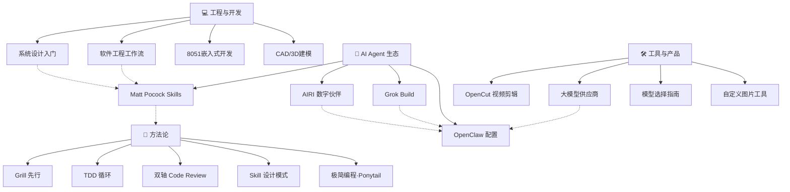

# 🗺️ 知识地图 — Knowledge Map

> 所有知识领域的索引与关联。最后更新: 2026-07-26（W30 新增 30+ 知识点、2 个新 Skill、7 个知识域同步）

---

## 🌐 Web 开发

> [[web-dev-2026]] — 2026 全栈技术栈（Next.js 15/RSC/Biome/Tailwind）
> [[github-web-dev-ai]] — GitHub 上的 AI+Web 开发资源 4 层次
> 对应 skill: [[web-dev-2026]]

## 🎮 极简编程 + 创意开发

> [[ponytail]] — AI 编程极简原则（能少写就少写）
> [[godot-card-draw]] — Godot 4 抽卡动画
> [[chinese-poetry]] — 最全古诗词数据库（5.5万+首）
> [[campus-box-design]] — 微信小程序校园服务平台设计
> 对应 skill: engineering-workflow · test-driven-development

## 💰 变现分析

> [[monetization-analysis]] — 基于现有能力的变现路径、可担任职位、立即行动方案
> [[ai-monetization-costs]] — 闲鱼实战价目表、工具成本、利润测算（最新五轮整合）

## 🎓 学术服务

> [[academic-service-research]] — 2026知网5.0应对、AI PPT行业报告、服务套餐设计、竞争分析
> [[ai-research-collaboration]] — 110亿Token的AI科研协作经验（Jadense）
> [[cnki-browser-plugin]] — 攻玉学术·知网浏览器插件 + MIMO PLAN API
> [[researchpilot-skills]] — AI科研全流程7阶段Skill套件
> [[vibe-research]] — AI辅助科研9阶段工具推荐清单
> [[nihaixia-skill]] — 倪海厦中医经方AI技能包

## 📂 领域总览



---

## ① 💻 工程与开发

| 领域 | 笔记 | 相关 skill | 掌握程度 |
|:----|:----|:----------|:--------:|
| 系统设计 | [[system-design-primer]] | — | 📖 学习 |
| 软件工程 | [[mattpocock-methodology]] | engineering-workflow | 🛠️ 可执行 |
| 嵌入式 | — | 8051-embedded-dev | 🛠️ 可执行 |
| CAD建模 | — | cad-design-master | 🛠️ 可执行 |
| 极简编程 | [[ponytail]] | engineering-workflow | 🛠️ 新增 |
| 创意开发 | [[godot-card-draw]] · [[chinese-poetry]] | — | 📖 新增 |
| 微信小程序 | [[campus-box-design]] | wechat-miniprogram-cloudbase | 📖 新增 |

### 关联关系
```
系统设计 (理论) → 软件工程 (实践) → 嵌入式/CAD (具体场景)
     ↑                     ↑
Matt Pocock 方法论     Grill+TDD 工作流
```

---

## ② 🤖 AI Agent 生态

| 领域 | 笔记 | 相关配置/工具 | 掌握程度 |
|:----|:----|:------------|:--------:|
| Agent Skills 方法论 | [[mattpocock-skills]] | engineering-workflow | 📖 学习 + 🛠️ 应用 |
| 行为改进 | [[mattpocock-methodology]] | [[../SOUL]] | 🛠️ 已采纳 |
| Agent 自我进化 | [[k-self-improvement]] · [[self-improvement-guide]] | Hermes Memory | 🛠️ 新增 |
| AI VTuber | [[airi]] | — | 📖 参考 |
| xAI 编码 Agent | [[grok-build]] | — | 📖 参考 |
| **AI Agent 深度研究** 🔥 | `.learnings/LEARNINGS.md` | — | 🟢 **深度吸收** |
| **Context Engineering** | LRN-20260724-001 | SOUL.md/MEMORY.md | 🟡 理解 |
| **Multi-Agent 编排** | LRN-20260724-003 | Skill Workshop | 🟡 理解 |
| **Memory 工程** | LRN-20260720-001/005/011 | SESSION-STATE.md | 🟡 理解 + 部分实践 |
| **Agent 治理/合规** | LRN-20260721-012 | ISO 42001 | 🔵 关注 |
| **Agent 互操作标准** | LRN-20260721-009 | MCP/A2A | 🔵 关注 |

### Agent 工具链对比

| 工具 | 定位 | 语言 | 许可证 | 与我们的关系 |
|:----|:----|:---:|:------:|:----------:|
| **OpenClaw/Hermes** (我们) | 全功能 Agent 平台 | Node.js | MIT | 🏠 当前平台 |
| **Grok Build** | Rust 编码 Agent TUI | Rust | Apache 2.0 | 🔬 竞品参考 |
| **OpenCode** | 终端编码 Agent | TypeScript | MIT | 🧩 部分集成 |
| **Claude Code** | Anthropic 编码 Agent | TypeScript | ❌ | 🔬 竞品/争议 |

### Hermes 配置体系 (W30 更新)

```
Fallback 链: opencode-go(6层) → SiliconFlow(2层) → DeepSeek直连 → OpenRouter(2层)
搜索冗余: Tavily + Exa + Firecrawl + DDGS + SearXNG (5路)
模型分层: 心跳/mimo-v2.5 → 日常/flash → 推理/pro+kimi → 兜底/直连+OpenRouter
成本优化: pro→flash 降68%, 异构tiering省60-70%
记忆体系: SESSION-STATE(活跃) → working-buffer(60%填充) → daily notes → MEMORY.md
```

---

## ③ 🛠️ 工具与产品

| 领域                    | 笔记                                                    | 适用场景       |      掌握程度       |
| :-------------------- | :---------------------------------------------------- | :--------- | :-------------: |
| 视频剪辑                  | [[opencut]]                                           | 批量自动生成视频   |      📖 关注      |
| 模型供应商                 | [[../TOOLS]]                                          | 日常使用       |     🛠️ 已配置     |
| 模型选择                  | [[../MEMORY]]                                         | 按任务选模型     |     🛠️ 可执行     |
| **Hermes 配置体系** (W30) | `.learnings/LEARNINGS.md`                             | Agent 基础设施 | 🟢 **🛠️ 全面加固** |
| 设计工具集                 | [[ai-tools-reference]] · [[ai-frontend-design-sites]] | PPT配图/前端参考 |      📖 新增      |
| 在线小工具                 | [[delphitools]] · [[6-online-tools]] · [[translumo]]  | 日常效率       |      📖 新增      |
| AI 写作工具               | [[show-me-the-story]]                                 | 长篇小说/去AI味  |      📖 新增      |
| 简历设计                  | [[ai-resume-prompt]]                                  | AI生图简历     |      📖 新增      |

### 模型分层体系

```
心跳/内部 ─── mimo-v2.5 ─── $0.14/$0.28
日常主力 ─── deepseek-v4-flash ─── $0.14/$0.28
复杂推理 ─── deepseek-v4-pro → kimi-k3
免费兜底 ─── DeepSeek 直连 ─── deepseek-chat
多模态 ─── minimax-m3 / gemma-4:free
```

---

## ④ 📐 方法论

| 方法论 | 笔记来源 | 已应用到的 skill | 核心价值 |
|:------|:--------|:---------------|:--------|
| **Grill 先行** | [[mattpocock-methodology]] | 8051, CAD, engineering-workflow | 消除理解偏差 |
| **完成标准** | [[mattpocock-methodology]] | 所有 skill | 防提前结束 |
| **渐进式披露** | [[mattpocock-skills]] | 待改进 | 减少上下文消耗 |
| **引导词** | [[mattpocock-skills]] | engineering-workflow | 压缩 token |
| **双轴审查** | [[mattpocock-skills]] | engineering-workflow | 代码质量 |
| **极简编程** | [[ponytail]] | 编程全场景 | 能少写就少写 |
| **上下文工程** | [[k-self-improvement]] | Agent 回复 | 上下文 > 提示词 |

---

## 🔗 完整关联表

| 笔记 | 上游知识 | 下游应用 | 平行参考 |
|:----|:--------|:--------|:--------|
| [[system-design-primer]] | — | 系统架构决策 | [[mattpocock-skills]] |
| [[mattpocock-skills]] | 工程经验 | [[mattpocock-methodology]] | engineering-workflow |
| [[mattpocock-methodology]] | [[mattpocock-skills]] | 8051/CAD/workflow skill | [[../AGENTS]] |
| [[airi]] | AI Agent 技术 | 多供应商集成参考 | [[grok-build]] |
| [[grok-build]] | AI 编码 Agent | 竞品分析 | [[airi]] |
| [[opencut]] | 视频编辑 | 自动化视频管线 | — |
| [[k-self-improvement]] | 搜索引擎研究 | Agent 行为优化 | [[self-improvement-guide]] |
| [[ai-monetization-costs]] | 闲鱼市场调研 | 变现落地执行 | [[monetization-analysis]] · [[academic-service-research]] |
| [[vibe-research]] | GitHub 社区研究 | AI 科研工具选型 | [[researchpilot-skills]] · [[ai-research-collaboration]] |
| [[campus-box-design]] | 微信小程序开发 | 校园服务平台 MVP | wechat-miniprogram-cloudbase（skill，未安装本地） |
| [[ponytail]] | 社区最佳实践 | 编程极简原则 | engineering-workflow |

---

## 📊 知识掌握度

```
🛠️ 可执行 ─── 可直接使用/执行
📖 学习 ─── 已学习记录，随用随查
🔬 关注 ─── 了解但不深入，持续关注
```

| 等级 | 领域 |
|:---:|:-----|
| 🛠️ **可执行** | 系统设计、软件工程工作流、嵌入式、CAD、模型选型、Agent自我进化、**Hermes 配置体系**、**PPT 设计**、**学术写作**、**Vault 运维** |
| 📖 **学习** | 视频编辑、AI VTuber 架构、Agent Skills 方法论、极简编程、创意开发、微信小程序、设计工具集、**Context Engineering**、**Multi-Agent 编排**、**Memory 工程**、**Agent 治理/合规** |
| 🔬 **关注** | Grok Build（竞品）、多模态模型、Edge AI on MCU、AI长篇小说工具、**Agent 互操作标准**、**OpenClaw Active Memory** |

---

> **W30 亮点**: 24+ 知识点的系统性吸收，2 个新 Skill 创建，配置体系全面加固，Vault 健康归零。详情见 [[../memory/2026/07/weekly-2026-07-26|本周学习总结]]。

---
[[HOME|🏠 返回首页]]
